# Tessera — Architecture

---

## High-level architecture

```mermaid
flowchart TB
    subgraph "Electron Renderer"
        UI["React / TypeScript UI (Lucide + Phosphor icons)"]
        Home["Home"]
        SourceMgr["Source manager"]
        TemplateGallery["Template gallery"]
        CreatePage["Create / Analyze / Plan / Approve"]
        Tasks["Tasks / Plans"]
        Automations["Automations"]
        DocEditor["Document editor"]
        SlideEditor["Slide editor (Marp mode)"]
        SheetEditor["Sheet editor"]
        BaseEditor["Base editor (Grid / Kanban / Calendar / Timeline / Gallery)"]
        InfographicEditor["Infographic editor"]
        LandingPageEditor["Landing Page editor"]
        Settings["Settings"]
        IconPicker["IconPicker (Lucide + Phosphor)"]
    end

    subgraph "Renderer services"
        MermaidRenderer["mermaidRenderer"]
        MarpRenderer["marpRenderer"]
        IconResolver["iconResolver"]
    end

    subgraph "Electron Main Process"
        IPC["Secure IPC"]
        RateLimiter["IPC rate limiter (token bucket)"]
        WinMgr["Window / menu / tray"]
        FilePicker["OS file picker"]
        OAuthHandoff["OAuth handoff"]
        NativeLoad["Native module loading"]
        SidecarSup["Sidecar supervision"]
        Scheduler["Automation scheduler"]
        MarpExport["Marp CLI PPTX export"]
        AutoUpdater["Auto-updater (electron-updater)"]
        CSPPolicy["CSP per-connector image-source policy"]
        PasswordVault["Password vault fallback (PBKDF2 + AES-GCM)"]
        ExternalProvider["External provider SSE streaming"]
    end

    subgraph "Rust Core"
        KnowledgeSub["Knowledge substrate"]
        EncStorage["Local encrypted storage"]
        FileIndex["File / folder indexing"]
        EmbeddingProv["Embedding provider (HashTrick / transformer)"]
        HybridSearch["Hybrid retrieval (BM25 + vector + RRF + recency)"]
        Retrieval["Retrieval engine"]
        TemplateEng["Template engine"]
        ArtifactEng["Artifact engine"]
        ExportEng["Export engine (MD / HTML / PDF / Typst PDF / DOCX / XLSX / CSV / JSON)"]
        ConnectorFW["Connector framework"]
        TasksModel["Tasks model"]
        PolicyAudit["Policy / audit layer"]
        NAPI["N-API bridge"]
    end

    subgraph "Local Model Runtime"
        LlamaCpp["llama.cpp / PrismML sidecar"]
        Bonsai["Bonsai / Ternary-Bonsai"]
        MLX["MLX for Apple Silicon"]
        LoopbackAPI["Local loopback inference API"]
    end

    subgraph "Connectors"
        LocalFolders["Local folders / files"]
        GDrive["Google Drive"]
        OneDrive["OneDrive / SharePoint"]
        Notion["Notion"]
        Jira["Jira"]
        Confluence["Confluence"]
        Figma["Figma"]
    end

    UI --> IPC
    Home --> IPC
    SourceMgr --> IPC
    TemplateGallery --> IPC
    CreatePage --> IPC
    Tasks --> IPC
    Automations --> IPC
    DocEditor --> IPC
    SlideEditor --> IPC
    SheetEditor --> IPC
    BaseEditor --> IPC
    InfographicEditor --> IPC
    LandingPageEditor --> IPC
    Settings --> IPC
    DocEditor --> MermaidRenderer
    SlideEditor --> MermaidRenderer
    SlideEditor --> MarpRenderer
    InfographicEditor --> IconPicker
    LandingPageEditor --> IconPicker
    IconPicker --> IconResolver

    IPC --> RateLimiter
    RateLimiter --> NAPI
    IPC --> NAPI
    WinMgr --> NAPI
    FilePicker --> NAPI
    OAuthHandoff --> NAPI
    NativeLoad --> NAPI
    SidecarSup --> LlamaCpp
    Automations --> Scheduler
    Scheduler --> NAPI
    SlideEditor --> MarpExport
    Settings --> AutoUpdater
    Settings --> ExternalProvider
    ExternalProvider --> LoopbackAPI
    WinMgr --> CSPPolicy
    WinMgr --> PasswordVault
    PasswordVault --> EncStorage

    NAPI --> KnowledgeSub
    NAPI --> EncStorage
    NAPI --> FileIndex
    NAPI --> EmbeddingProv
    NAPI --> HybridSearch
    HybridSearch --> EmbeddingProv
    HybridSearch --> Retrieval
    NAPI --> Retrieval
    NAPI --> TemplateEng
    NAPI --> ArtifactEng
    NAPI --> ExportEng
    NAPI --> ConnectorFW
    NAPI --> TasksModel
    NAPI --> PolicyAudit

    ConnectorFW --> LocalFolders
    ConnectorFW --> GDrive
    ConnectorFW --> OneDrive
    ConnectorFW --> Notion
    ConnectorFW --> Jira
    ConnectorFW --> Confluence
    ConnectorFW --> Figma

    LlamaCpp --> Bonsai
    LlamaCpp --> MLX
    LlamaCpp --> LoopbackAPI
    ArtifactEng --> LoopbackAPI
```



---

## Recommended stack

| Layer             | Technology                                                                                                                                                                                                                                                                                                                           | Reason                                                                                                                                                                                                                                                                                                                                                                                                                                                                             |
| ----------------- | ------------------------------------------------------------------------------------------------------------------------------------------------------------------------------------------------------------------------------------------------------------------------------------------------------------------------------------ | ---------------------------------------------------------------------------------------------------------------------------------------------------------------------------------------------------------------------------------------------------------------------------------------------------------------------------------------------------------------------------------------------------------------------------------------------------------------------------------- |
| Desktop shell     | Electron                                                                                                                                                                                                                                                                                                                             | Cross-platform desktop with native access                                                                                                                                                                                                                                                                                                                                                                                                                                          |
| UI framework      | React + TypeScript + Lucide + Phosphor icons                                                                                                                                                                                                                                                                                         | Productivity UI with strong typing and two complementary icon families (Lucide for action / outline, Phosphor for weighted / branded glyphs)                                                                                                                                                                                                                                                                                                                                       |
| Editor stack      | TipTap (ProseMirror) for documents, custom Slide / Sheet / Base / Infographic / Landing Page editors                                                                                                                                                                                                                                 | Block-level editing with citations and live preview                                                                                                                                                                                                                                                                                                                                                                                                                                |
| Diagrams & slides | Mermaid (diagrams), Marp Core + Marpit (slides), Typst (high-fidelity PDF / SVG)                                                                                                                                                                                                                                                     | First-class rendering integrations wired into both the editors and the export pipeline                                                                                                                                                                                                                                                                                                                                                                                             |
| Core engine       | Rust                                                                                                                                                                                                                                                                                                                                 | Performance, memory safety, indexing, storage, crypto                                                                                                                                                                                                                                                                                                                                                                                                                              |
| Optional later    | Go                                                                                                                                                                                                                                                                                                                                   | Remote connector daemons, network services                                                                                                                                                                                                                                                                                                                                                                                                                                         |
| Local database    | SQLite / SQLCipher                                                                                                                                                                                                                                                                                                                   | Local-first, encrypted, single-file DB                                                                                                                                                                                                                                                                                                                                                                                                                                             |
| Search            | FTS5 full-text + pluggable `EmbeddingProvider` (default `HashTrickEmbedding` offline; optional ONNX Runtime `OnnxEmbeddingProvider` with `all-MiniLM-L6-v2` 22 MB English or `paraphrase-multilingual-MiniLM-L12-v2` ~120 MB multilingual, both 384-dim) + Reciprocal Rank Fusion (k=60) + temporal recency decay (30-day half-life) | Hybrid retrieval without external services; BM25 captures keywords, the embedding signal handles typos / substrings / paraphrase, RRF combines the rankings on rank rather than incomparable raw scores, and the recency decay biases toward fresh material when content similarity ties. The transformer-backed embeddings are opt-in — users can stay fully offline with HashTrick or upgrade to semantic recall (English-only or 50+ languages) without changing the vector dim |
| Model runtime     | llama.cpp / PrismML sidecar                                                                                                                                                                                                                                                                                                          | Local GGUF model inference                                                                                                                                                                                                                                                                                                                                                                                                                                                         |
| Apple Silicon     | MLX                                                                                                                                                                                                                                                                                                                                  | macOS ARM acceleration                                                                                                                                                                                                                                                                                                                                                                                                                                                             |
| Electron bridge   | N-API                                                                                                                                                                                                                                                                                                                                | Low-overhead Rust ↔ Node.js calls                                                                                                                                                                                                                                                                                                                                                                                                                                                  |
| Packaging         | electron-builder / Electron Forge                                                                                                                                                                                                                                                                                                    | Platform-specific installers                                                                                                                                                                                                                                                                                                                                                                                                                                                       |

---

## Why Rust

Rust is the primary systems language for Tessera's core engine. It handles:

- File scanning and folder watching
- Hashing and deduplication (BLAKE3)
- Text extraction from multiple file formats
- Chunking and embedding orchestration
- Hybrid retrieval (FTS5 + vector + recency)
- Encrypted local storage (SQLCipher)
- Artifact generation pipeline
- Connector sync framework
- Audit trail logging
- Export engine (Markdown, HTML, PDF, CSV, JSON, Typst PDF, DOCX, XLSX) with Mermaid block handling
- Model runtime supervision (sidecar lifecycle)
- N-API bridge to Electron

Go can come later for remote services and connector daemons. Rust-first is cleaner because the knowledge substrate ([kennguy3n/knowledge](https://github.com/kennguy3n/knowledge)) is already Rust-oriented.

---

## Knowledge substrate integration

The knowledge substrate ([kennguy3n/knowledge](https://github.com/kennguy3n/knowledge)) is Tessera's local memory and retrieval layer.

### Data flow

```
Source data → Evidence storage → Observation / chunking → Memory management →
Concept graph → Retrieval → Source pack → Artifact generation → Citation tracking → Audit log
```

### 20-crate architecture

The substrate is composed of modular Rust crates:

| Crate                | Role                                                                    |
| -------------------- | ----------------------------------------------------------------------- |
| `evidence_store`     | Encrypted append-only storage, hybrid retrieval                         |
| `observation_engine` | Entity and fact extraction from evidence                                |
| `memory_manager`     | Decay state machine, retention scoring, working memory                  |
| `concept_graph`      | Higher-order synthesized entities and relationships                     |
| `synthesis_pipeline` | Transformation of observations into concepts                            |
| `inference_router`   | Dispatcher for SLM tasks with grammar constraints                       |
| `agent_contract`     | Lifecycle and promotion logic for agent-generated claims                |
| `crypto`             | PQC primitives, DEK management, XChaCha20-Poly1305                      |
| `ffi`                | UniFFI bridge for iOS (Swift) and Android (Kotlin)                      |
| `napi`               | Node.js / Electron bindings for macOS, Windows, and Linux (x64 + arm64) |
| `export_plane`       | Governance, policy simulation, data egress controls                     |

### Hybrid retrieval pipeline

Search inside Tessera runs through `crates/tessera_sources/src/hybrid.rs`
(`hybrid_search`) which combines three independent ranking signals:

- **BM25 lexical** from SQLite FTS5 (`search_fts`) — dominant for keyword
  queries, struggles with typos and paraphrase.
- **Vector cosine** via the `EmbeddingProvider` trait
  (`crates/tessera_sources/src/embedding.rs`). The default offline
  implementation `HashTrickEmbedding` produces signed character-n-gram
  vectors (Weinberger et al. 2009, dim=256, char 3..=5) so partial
  matches and typos surface without a transformer. Two
  transformer-backed providers are available behind the same trait
  (`crates/tessera_sources/src/onnx_embedder.rs`, ONNX Runtime CPU EP):
  `all-MiniLM-L6-v2` (22 MB, English, 384-dim) and
  `paraphrase-multilingual-MiniLM-L12-v2` (~120 MB INT8 quantized, 50+
  languages including all nine non-English locales Tessera ships
  templates for, 384-dim). Tokenization runs through HuggingFace
  `tokenizers` so CJK / Arabic / Devanagari / Hangul / Cyrillic flow
  through unchanged; mean-pooling weights tokens by the attention mask
  and the output is L2-normalised. Both transformer models export the
  same dim, so the ANN index, cosine code, and `chunk_embeddings`
  storage layout are invariant on a switch — the only thing that
  changes is `chunk_embeddings.model_id`, which acts as a versioning
  key so cached vectors from the previous provider are filtered out
  and re-embedded through `backfill_embeddings_tracked`.
- **Temporal recency** via `recency_multiplier(age_secs, halflife_secs)`,
  a true half-life decay (`2^(-Δt / halflife)`, default 30-day half-life)
  applied multiplicatively to the fused score so fresh material wins ties.

The three signals are fused via **Reciprocal Rank Fusion**
(Cormack 2009, k=60) — operating on ranks instead of raw scores
sidesteps the cross-scale tuning that any weighted-sum approach would
require. Per-signal weights and the recency half-life are configurable
through `HybridSearchConfig`; setting `vector_weight` to 0 collapses
the pipeline to BM25 + recency.

#### Embedding provider tiers

The vector signal supports three interchangeable providers, all behind
the same `EmbeddingProvider` trait. The Settings page exposes them as
a single radio group; switching providers swaps the active backend and
triggers `backfill_embeddings_tracked` to re-embed the entire corpus
under the new `model_id`.

| Tier                        | `model_id`                                        | Dim | Download     | Languages                                                                                                 | When to pick it                                                                                                                                      |
| --------------------------- | ------------------------------------------------- | --- | ------------ | --------------------------------------------------------------------------------------------------------- | ---------------------------------------------------------------------------------------------------------------------------------------------------- |
| **Fast**                    | `hash-trick-v1-256d-char3-5`                      | 256 | 0 (bundled)  | Script-agnostic ASCII bias                                                                                | The default — fully offline, no network. Good baseline for English-with-typography; recall suffers on paraphrase and cross-lingual queries.          |
| **Semantic — English**      | `onnx:all-MiniLM-L6-v2:384d`                      | 384 | 22 MB        | English                                                                                                   | Smallest semantic option. Best per-MB recall for an English-only workspace; will _not_ embed CJK / Arabic / Devanagari well.                         |
| **Semantic — Multilingual** | `onnx:paraphrase-multilingual-MiniLM-L12-v2:384d` | 384 | ~120 MB INT8 | 50+ languages including all nine non-English Tessera locales (es / fr / de / ja / zh / pt / ko / ar / hi) | Recommended default when any non-English content is indexed. Same retrieval API and same 384-dim, so the rest of the hybrid pipeline doesn't branch. |

The renderer surfaces an auto-recommendation: if the indexed corpus
has at least 50 chunks and more than 10 % of them contain non-ASCII
text, the Settings card highlights the multilingual option. The hint
is suppressed when the multilingual model is already active or when
the corpus is too small to draw a meaningful conclusion from.

### User experience

Users experience the substrate as:

- Searchable sources with relevant context
- Source-backed suggestions during artifact creation
- Inline citations with provenance
- Better artifact generation grounded in real data

#### Knowledge browser UI (shipping in the renderer)

The substrate is also directly browsable in the shipping app — not just a
backend. The renderer surfaces it through:

- **Memory page** (`/memory`, `apps/desktop/renderer/src/pages/MemoryPage.tsx`)
  — reachable from the **Memory** item in the sidebar ("More tools" tier,
  `Ctrl/Cmd+9`, see `navigation.ts`) and mounted as a route in `App.tsx`. It
  lists memories with their decay state and retention and embeds the
  concept-graph panel.
- **Concept-graph panel** (`components/ConceptGraphPanel.tsx`, helpers in
  `utils/conceptGraph.ts`) — renders concept nodes and their typed links over
  the user's own sources.
- **"Knowledge" citation tab** (`components/CitationPanel.tsx`) — the additive
  Sources/Knowledge tabbed view (entities/facts/concepts alongside source
  chunks), opened from the **Citations** button in the artifact editor
  (`pages/ArtifactEditorPage.tsx`). The Knowledge plane degrades to an empty
  tab rather than breaking the panel if the substrate is unavailable.
- **HomePage knowledge insights** (`hooks/useSubstrateInsights.ts`, rendered in
  `pages/HomePage.tsx`) — a "Knowledge insights" card summarizing the memory
  plane and concept graph, plus a substrate section on each source's detail
  page (`pages/SourceDetailPage.tsx`).
- **Connector gallery** (`components/ConnectorsList.tsx`) — a searchable,
  categorized remote-connector gallery with health and scope transparency.

---

## Electron boundary

Tessera enforces a **strict security boundary** between the renderer and native capabilities.

```
React renderer → typed IPC → Electron main → N-API / child process → Rust core → local storage, connectors, model sidecars
```

### Anti-patterns to avoid

| Anti-pattern                      | Why it's dangerous                     |
| --------------------------------- | -------------------------------------- |
| Renderer directly accessing files | Bypasses OS permission model           |
| Renderer managing model server    | Exposes process control to web context |
| Renderer holding OAuth tokens     | Tokens accessible to any renderer code |
| Renderer accessing encrypted DB   | Encryption keys exposed to web context |

### TypeScript API interfaces

```typescript
interface SourceApi {
  addLocalFolder(path: string): Promise<SourceResult>;
  addLocalFile(path: string): Promise<SourceResult>;
  connectRemote(
    provider: RemoteProvider,
    config: RemoteConfig,
  ): Promise<SourceResult>;
  reindexSource(sourceId: string): Promise<void>;
  searchSources(
    query: string,
    options?: SearchOptions,
  ): Promise<SearchResult[]>;
}

interface ArtifactApi {
  createFromTemplate(
    templateId: string,
    sourceIds: string[],
    options?: CreateOptions,
  ): Promise<Artifact>;
  updateArtifact(
    artifactId: string,
    changes: ArtifactChanges,
  ): Promise<Artifact>;
  exportArtifact(
    artifactId: string,
    format: ExportFormat,
  ): Promise<ExportResult>;
}

interface ModelApi {
  getRuntimeStatus(): Promise<RuntimeStatus>;
  listAvailableModels(): Promise<ModelInfo[]>;
  generateArtifactDraft(request: GenerateRequest): AsyncIterable<GenerateChunk>;
  cancelJob(jobId: string): Promise<void>;
}
```

---

## Local model runtime

### PrismML llama.cpp fork

Tessera uses the PrismML fork of llama.cpp ([kennguy3n/llama.cpp@prism](https://github.com/kennguy3n/llama.cpp)) for local model inference.

### Adapter bootstrap priority

```
MLXAdapter → LlamaCppAdapter → ExternalAdapter → Fallback (no model, extraction-only mode)
```

The `ExternalAdapter` is disabled by default. When the user enables it
on the Settings page, the renderer writes provider configuration to
`apps/desktop/electron/config.ts` and stores the API key in the OS
keychain through the same `tokenVault` pattern used by OAuth tokens
(`apps/desktop/electron/secretsVault.ts`). The adapter speaks either the
OpenAI-compatible `/v1/chat/completions` endpoint (covers OpenAI,
Ollama, vLLM, LM Studio) or the Anthropic `/v1/messages` endpoint, and
the chain falls through to it when both local adapters report
unavailable. See `crates/tessera_runtime/src/external_provider.rs`.

### Inference tasks

| Task                       | Description                                        |
| -------------------------- | -------------------------------------------------- |
| Importance tagging         | Classify evidence chunks by importance tier        |
| Entity extraction          | Extract named entities from text                   |
| Observation promotion      | Promote raw observations to verified facts         |
| Summary generation         | Generate summaries from source packs               |
| Concept synthesis          | Synthesize higher-order concepts from observations |
| Contradiction adjudication | Detect and resolve conflicting information         |

### Shared sidecar pattern

Single `llama-server` process with:

- `--parallel 2` for concurrent requests
- `mmap` for efficient model loading
- 60-second idle-unload to free memory when not in use

### Grammar-constrained decoding

GBNF (GGML BNF) grammars constrain model output to valid structured formats (JSON, YAML, typed schemas). This ensures generated artifact content is parseable and well-formed.

---

## Platform-specific notes

### Auto-update on every platform

Tessera ships an in-app auto-updater backed by
[`electron-updater`](https://www.electron.build/auto-update). The
desktop main process wraps `electron-updater` in
`apps/desktop/electron/autoUpdater.ts` and exposes the
`updates:status` / `updates:check` / `updates:install` /
`updates:getAutoUpdateEnabled` / `updates:setAutoUpdateEnabled`
channels documented in [`docs/IPC_AUDIT.md`](docs/IPC_AUDIT.md). The
renderer subscribes to `updates:status` for ambient toast UX. Auto-
update can be disabled from the Settings page.

### macOS

| Component         | Detail              |
| ----------------- | ------------------- |
| Shell             | Electron 31 + React |
| Native addon      | Swift N-API addon   |
| Preferred runtime | MLX (MLXAdapter)    |
| Embeddings        | Core ML             |
| Fallback          | LlamaCppAdapter     |

### Windows

| Component    | Detail                                               |
| ------------ | ---------------------------------------------------- |
| Shell        | Electron 31 + React                                  |
| Native addon | C++ N-API addon                                      |
| Runtime      | LlamaCppAdapter                                      |
| CPU-only     | AVX2 minimum, AVX-VNNI / AVX-512 VNNI when available |
| CPU+GPU      | Vulkan / CUDA backend                                |
| Embeddings   | DirectML EP                                          |
| Fallback     | ONNX Runtime CPU EP                                  |
| Packaging    | NSIS installer (`.exe`), portable `.zip`             |

### Linux

| Component    | Detail                                                    |
| ------------ | --------------------------------------------------------- |
| Shell        | Electron 31 + React                                       |
| Native addon | C++ N-API addon                                           |
| Runtime      | LlamaCppAdapter                                           |
| CPU          | AVX2 minimum, AVX-VNNI / AVX-512 VNNI, ARM NEON / dotprod |
| GPU          | Vulkan, CUDA (NVIDIA), ROCm (AMD)                         |
| Embeddings   | ONNX Runtime CPU EP                                       |
| Packaging    | AppImage, `.deb` (x64 + arm64)                            |

### Model selection architecture

Selection happens in three independent dimensions that are resolved in this order:

1. **Platform → format.** `detect_platform()` (in `crates/tessera_runtime/src/config.rs`) maps the running target triple to one of `macos-apple-silicon`, `macos-intel`, `windows-x64`, `linux-x64`, `linux-arm64`. macOS Apple Silicon prefers MLX 2-bit; every other platform uses GGUF Q1_0_g128 from the PrismML llama.cpp fork. Q4_K_M is intentionally NOT used — the Q1_0_g128 ternary repack is what makes Bonsai 1.58-bit small (≈248 MB for the 1.7B MLX, ≈450 MB for the 1.7B GGUF).
2. **Device tier → model size.** `sys_total_ram_gb()` reads physical RAM (sysctl on macOS, `/proc/meminfo` on Linux, PowerShell `Get-CimInstance` then `wmic` fallback on Windows) and buckets it into `low` (1.7B), `medium` (4B), or `high` (8B).
3. **GPU detection → compute backend.** `detect_compute_backends()` returns the set of acceleration paths actually available on the box (`cpu` is always present; `cuda` when `nvidia-smi` runs; `vulkan` when the runtime library is present; `rocm` on Linux when `/opt/rocm` exists; `metal` on Apple Silicon). The PrismML ggml dispatcher selects the per-kernel implementation at run time, but the substrate still needs the right _binary variant_ of `llama-server` — the install scripts (`sidecars/scripts/download-llama-server.{sh,ps1}`) take `--compute=<backend>` and pin one variant per machine.

The full registry lives in `sidecars/models.json`. `available_models_for_platform()` filters that registry down to the three sizes valid for the current platform, and `select_model(tier, platform)` picks exactly one. Single-model enforcement (`apps/desktop/electron/modelManagement.ts`) guarantees that swapping tier or size deletes the prior file _before_ the new download starts, so only one model weight ever lives on disk.

### Device tiering

| Tier       | Available RAM | Capability                                                                             |
| ---------- | ------------- | -------------------------------------------------------------------------------------- |
| **Low**    | 2–3 GB        | Lexicon classifiers + XLM-R INT4 embeddings only, no SLM                               |
| **Medium** | 4–6 GB        | XLM-R INT8 + Bonsai-1.7B gated to active scope                                         |
| **High**   | 8+ GB         | Always-on Bonsai-1.7B / 4B / 8B (MLX 2-bit on Apple Silicon, GGUF Q1_0_g128 elsewhere) |

---

## Security and privacy

| Principle              | Implementation                                                                                                                                                                                                                                                                                                                                                                                                                                                                                                                                   |
| ---------------------- | ------------------------------------------------------------------------------------------------------------------------------------------------------------------------------------------------------------------------------------------------------------------------------------------------------------------------------------------------------------------------------------------------------------------------------------------------------------------------------------------------------------------------------------------------ |
| Local-first storage    | All data stored on-device by default                                                                                                                                                                                                                                                                                                                                                                                                                                                                                                             |
| Explicit source access | User authorizes each source connection                                                                                                                                                                                                                                                                                                                                                                                                                                                                                                           |
| Encrypted storage      | SQLCipher (via rusqlite `bundled-sqlcipher-vendored-openssl`). 256-bit raw key generated on first launch (`crypto.randomBytes(32)`), wrapped via Electron `safeStorage` (Keychain on macOS, DPAPI on Windows, libsecret on Linux), persisted at `<userData>/db.key`, applied with `PRAGMA key = "x'<hex>'"` at bridge init. Existing plaintext databases are transparently re-encrypted in place via `sqlcipher_export` on first launch with a key. See `apps/desktop/electron/dbKey.ts` and `crates/tessera_core/src/db.rs` for the full chain. |
| Safe renderer          | No direct file, token, or model access from renderer                                                                                                                                                                                                                                                                                                                                                                                                                                                                                             |
| Secure IPC             | Typed, validated messages between renderer and main process                                                                                                                                                                                                                                                                                                                                                                                                                                                                                      |
| Token vault            | OAuth tokens stored in OS keychain, never exposed to renderer                                                                                                                                                                                                                                                                                                                                                                                                                                                                                    |
| Audit log              | All source connections, syncs, generations, and exports logged                                                                                                                                                                                                                                                                                                                                                                                                                                                                                   |
| Revocation             | Disconnect removes local index and revokes remote tokens                                                                                                                                                                                                                                                                                                                                                                                                                                                                                         |
| Citation tracking      | Every generated section links to its source material                                                                                                                                                                                                                                                                                                                                                                                                                                                                                             |

### Defense-in-depth controls

In addition to the baseline principles above, Tessera ships the
following defense-in-depth controls. Every control is pinned by a
regression test under `apps/desktop/electron/__tests__/`.

- **Password vault fallback.** When `safeStorage` cannot reach an OS
  keyring (headless Linux, certain CI runners), Tessera falls back to
  a user-supplied passphrase that derives a 256-bit key via
  **PBKDF2-SHA256 with 600 000 iterations** and a per-installation
  random salt, then wraps the SQLCipher DB key + OAuth tokens + API
  keys with **AES-256-GCM**. The vault is unlocked at startup by an
  ephemeral `BrowserWindow` (loaded via `data:text/html`, `sandbox:
true`, single-purpose preload). See
  `apps/desktop/electron/passwordVault.ts`,
  `vaultCrypto.ts`,
  `passwordPromptPreload.ts`,
  `passwordPromptChannels.ts`.
- **CSP per-connector image-source allow-list.** The previous wildcard
  `https:` image source was replaced by an explicit allow-list keyed
  off the connected providers; only the CDN hosts that ship thumbnails
  for the user's enabled connectors are allowed. See
  `apps/desktop/electron/cspImageSources.ts`.
- **IPC rate limiter.** Token-bucket limiter on expensive channels
  (search, generate, indexing actions) so a compromised renderer
  cannot exhaust the main process. See
  `apps/desktop/electron/ipc/rateLimiter.ts`.
- **Export-path containment.** Every renderer-initiated file write
  resolves against an allow-list before reaching disk; symlinks and
  `..` traversal are rejected at the IPC boundary. See
  `apps/desktop/electron/exportPathSafety.ts`.
- **Extracted-item schema + HTML escape.** Every batch of extracted
  tasks / decisions / risks the bridge surfaces is validated against a
  zod schema and the renderer-bound string fields are HTML-escaped
  before display so an attacker-controlled source file cannot inject
  script into the Tessera UI. See
  `apps/desktop/electron/extractedItemValidation.ts`.
- **IPC audit.** Every `ipcMain.handle()` channel is enumerated, with
  its validation strategy and auth flag, in
  [`docs/IPC_AUDIT.md`](docs/IPC_AUDIT.md). CI fails if a new channel
  ships without an entry in that table.
- **Auto-updater.** `electron-updater` is wrapped behind the
  `updates:*` channels (`updates:status`, `updates:check`,
  `updates:install`, `updates:getAutoUpdateEnabled`,
  `updates:setAutoUpdateEnabled`). The renderer subscribes to
  `updates:status` for ambient toast UX and the user can disable
  background checks from Settings. See
  `apps/desktop/electron/autoUpdater.ts`.

---

## Repository layout

```
tessera/
├── apps/
│   └── desktop/
│       ├── electron/                # Electron main process
│       │   ├── main.ts              # App entry, window management, will-quit drain, CSP install
│       │   ├── ipc.ts               # Legacy aggregator that re-exports the modular `ipc/` directory
│       │   ├── ipc/                 # Per-domain IPC modules (idempotent registration via `register.ts`)
│       │   │   ├── register.ts          # `idempotentHandle()` helper — remove-then-handle for every channel
│       │   │   ├── rateLimiter.ts       # Token-bucket rate limiter on expensive channels
│       │   │   ├── validate.ts          # `assertId` / `assertString` / `assertNumber` / `assertStringArray`
│       │   │   ├── schemas.ts           # zod schemas for object-arg channels
│       │   │   ├── shared.ts            # cross-domain helpers (`getSafeExportRoots`, `getDenyExportRoots`)
│       │   │   ├── sources.ts           # `sources:*` handlers
│       │   │   ├── artifacts.ts         # `artifacts:*` handlers (export-path safety wired through `denyRoots`)
│       │   │   ├── citations.ts         # `citations:*` handlers
│       │   │   ├── settings.ts          # `settings:*` + `externalProvider:*` handlers
│       │   │   ├── templates.ts         # `templates:*` handlers
│       │   │   ├── model.ts             # `model:*` handlers + `activeGenerationController` cancellation
│       │   │   ├── runtime.ts           # `runtime:*` handlers
│       │   │   ├── tasks.ts             # `tasks:*` handlers
│       │   │   ├── automations.ts       # `automations:*` handlers
│       │   │   ├── audit.ts             # `audit:*` handlers
│       │   │   ├── vision.ts            # `vision:*` handlers (VLM image / PDF / chart extraction)
│       │   │   ├── imagegen.ts          # `imagegen:*` handlers (image-generation capability)
│       │   │   ├── kchat.ts             # `kchat:*` + `sources:addKchatChannel` + `sources:backfillKchatChannel` handlers; LRU caches for name enrichment; backfill orchestrator + live counters for `kchat:backfillProgress`
│       │   │   ├── dialog.ts            # `dialog:showSaveDialog`
│       │   │   ├── context.ts           # shared context object passed into every handler
│       │   │   ├── connectors/          # per-provider OAuth + sync handlers (gdrive / onedrive / notion / jira / confluence / figma)
│       │   │   └── index.ts             # `registerAllIpcHandlers()`
│       │   ├── kchat/                   # KChat (Mattermost v4) integration — see "KChat integration" section below
│       │   │   ├── kchatAuth.ts             # `KchatAuthService`: PAT auth, vault wiring, WebSocket lifecycle, refresh handlers, symmetric teardown ordering (`authMode = "none"` before `client.shutdown()`)
│       │   │   ├── kchatClient.ts           # REST client (channels / posts / files / users); deserialisation-boundary validation of every server-id field
│       │   │   ├── kchatLocalApi.ts         # Loopback HTTP API the `.kcz` extension running inside KChat Desktop talks to. Binds to `127.0.0.1` only; bearer-token auth (`crypto.randomBytes(32)` → base64url, timing-safe compare); Host-header SSRF guard; 64 KiB body cap; routes: `GET /api/status`, `GET /api/sources`, `POST /api/ingest-channel`, `POST /api/share-artifact`. Discovery via `{userData}/tessera-kchat-port.json` (mode 0600 via atomic rename). Heartbeat tracked in `requireBearer()` for Settings-card "KChat Desktop detected" affordance
│       │   │   ├── kchatDeeplinkBridge.ts   # `tessera://` deeplink parser + pre-ready route parker. Routes: `tessera://source/<id>`, `tessera://artifact/<id>`, `tessera://ingest?channel=&team=`. Listens on `open-url` (macOS), `second-instance` (Win/Linux warm-start), and the single-instance-lock else branch's argv scan (Win/Linux cold-start) — URLs received before the renderer's consumer registers are parked FIFO and replayed once `whenReady` resolves
│       │   │   ├── kchatEventForwarder.ts   # Bridges WebSocket events to bridge-side handlers (`file_added` targeted sync, `user_added/removed/member_updated` ACL projection, `channel_archived/deleted` cryptoshred)
│       │   │   ├── kchatChannelSyncer.ts    # Channel-files sync + historical-backfill watermark loop with drain-on-quit
│       │   │   ├── kchatNameCache.ts        # Bounded LRU resolving KChat user/channel ids → display names; touch-on-read, FIFO-eviction-at-bound; module-scoped singletons reset on `KchatAuthService.onStatusChange("none")`
│       │   │   ├── kchatPaths.ts            # Canonical filesystem layout (`~/.tessera/kchat-channels/<channel-id>/`)
│       │   │   ├── kchatTypes.ts            # Shared types (`KchatAuthMode`, …)
│       │   │   └── ssrfGuard.ts             # `enforceKchatServerUrl` — scheme / host / port allow-list; re-validated on vault restore
│       │   ├── appState.ts          # Bridge initialization, async DB-key path, password-vault hand-off
│       │   ├── preload.ts           # Typed preload API exposed to renderer
│       │   ├── sidecar.ts           # Model sidecar supervision
│       │   ├── scheduler.ts         # Automation scheduler (activeTick / queuedRunNow state machine, `will-quit` drain)
│       │   ├── marpExport.ts        # Marp CLI PPTX / HTML / PDF export
│       │   ├── typstExport.ts       # Typst export wrapper
│       │   ├── autoUpdater.ts       # `electron-updater` wrapper, `updates:*` channels, status broadcast
│       │   ├── cspImageSources.ts   # Per-connector CSP image-source allow-list
│       │   ├── dbKey.ts             # SQLCipher key generation + wrap via safeStorage; password-vault fallback
│       │   ├── exportPathSafety.ts  # Export-path containment (renderer-supplied paths constrained to allow-list)
│       │   ├── extractedItemValidation.ts # zod-shape validation of bridge-supplied extracted items; XSS-escape
│       │   ├── externalProviderStream.ts  # Real SSE parser for OpenAI-compatible + Anthropic streaming
│       │   ├── passwordVault.ts     # PBKDF2 + AES-256-GCM fallback when safeStorage is unavailable
│       │   ├── vaultCrypto.ts       # AES-256-GCM primitives used by passwordVault
│       │   ├── passwordPromptPreload.ts   # Ephemeral preload for the password-prompt window
│       │   ├── passwordPromptChannels.ts  # `password-vault:submit` / `password-vault:cancel` channel names
│       │   ├── modelManagement.ts   # Single-model-on-disk enforcement
│       │   ├── secretsVault.ts      # API-key vault wrapper (used by externalProvider)
│       │   ├── tokenVault.ts        # OAuth token vault wrapper (used by connectors)
│       │   ├── oauth.ts             # OAuth helper utilities
│       │   ├── logger.ts            # JSONL logger
│       │   └── config.ts            # Local JSON settings persistence (hybridSearchConfig, externalProviderTokenUsage, etc.)
│       └── renderer/                # React / TypeScript UI
│           ├── src/
│           │   ├── pages/               # Home, Sources, SourceDetail, Templates, Create, Tasks, Automations, Settings, ArtifactEditor
│           │   ├── components/          # CitationPanel, VersionHistory, RuntimeStatus, IconPicker, Sidebar
│           │   ├── editors/             # DocumentEditor (TipTap + Mermaid extension), SlideEditor (with Marp mode), SheetEditor, BaseEditor (5 views), InfographicEditor, LandingPageEditor
│           │   │   ├── baseviews/       # KanbanView, CalendarView, TimelineView, GalleryView, types.ts
│           │   │   └── extensions/      # TipTap Mermaid extension
│           │   ├── services/            # mermaidRenderer, marpRenderer, iconResolver (Lucide + Phosphor + token rewriter)
│           │   ├── hooks/               # React hooks for IPC calls (useTasks, useAutomations, …)
│           │   ├── types/               # TypeScript type definitions (ipc.ts)
│           │   └── styles/              # Design tokens, theme
│           └── index.html
├── crates/                          # Rust core engine
│   ├── tessera_core/                # Core types, config, lifecycle (ArtifactType: Document/Slides/Sheet/Base/Infographic/LandingPage); typed DB errors (`Error::Sqlite` wrapping `rusqlite`, `Error::DatabaseState` for semantic failures); CPU-count-auto-sized + pre-warmed read pool in `db.rs`
│   ├── tessera_migrate/             # Versioned, forward-only SQL migration runner — numbered `.sql` files in `migrations/` tracked in a `_migrations` table (with rollback stubs); replaces the ad-hoc migration blocks formerly inlined in `tessera_sources`
│   ├── tessera_bridge/              # N-API bindings for Electron
│   ├── tessera_sources/             # Source management, file indexing, `.gitignore`-style ignore patterns, EXIF/XMP/IPTC image metadata extraction, incremental re-index progress tracker, `embedding.rs` (EmbeddingProvider trait + HashTrickEmbedding), `onnx_embedder.rs` + `model_registry.rs` (ONNX Runtime sentence-transformer providers — `all-MiniLM-L6-v2` and `paraphrase-multilingual-MiniLM-L12-v2`, both 384-dim, SHA-256-verified, resumable downloads), `hybrid.rs` (BM25 + vector + RRF + recency), `vector_index.rs` (IVF-Flat ANN with k-means centroids), `search.rs` (engine entry point), `progress.rs`, `kchat_crypto.rs` (per-source DEK + column-level AES-256-GCM for `kchat_posts`), `vision_extractor.rs` / `pdf_extractor.rs` (VLM-powered image / PDF / chart extraction), `fetch_kchat_thread_context` on `SourceStore` (parent-thread retrieval up to 3 levels)
│   ├── tessera_templates/           # Template parsing and validation (Create / Analyze / Plan / Approve categories)
│   ├── tessera_artifacts/           # Artifact creation, version history, storage; tasks model with `depends_on` dependency graph + topological cycle detection; automations with `on_kchat_message_match` trigger and multi-step `sequence` actions; all deletion paths wrapped in `with_secure_delete`
│   ├── tessera_export/              # csv.rs, markdown.rs, html.rs, pdf.rs, typst.rs, docx.rs, xlsx.rs, mermaid.rs, evidence_pack.rs
│   ├── tessera_citations/           # Citation tracking, freshness checks, replace/remove flows, audit-event integration
│   ├── tessera_connectors/          # gdrive.rs, onedrive.rs, notion.rs, jira.rs, confluence.rs, figma.rs + registry/token/types
│   ├── tessera_runtime/             # Local model runtime + optional `external_provider` HTTP adapter (OpenAI-compatible / Anthropic / custom)
│   └── tessera_audit/               # Audit trail logging
├── extensions/                      # KChat Desktop extensions packaged as `.kcz` archives
│   └── tessera-kchat/               # `.kcz` extension that runs *inside* KChat Desktop and talks to Tessera over the loopback HTTP API
│       ├── manifest.json            # Extension identity (`com.tessera.kchat-bridge`), declared procedures, contributed views, permissions
│       ├── src/
│       │   ├── index.tsx            # Extension entry point — registers the rightbar view, opens a `TesseraLocalApiClient` against the discovered port
│       │   ├── client.ts            # Typed HTTP client (`TesseraLocalApiClient`) — calls `GET /api/status`, `GET /api/sources`, `POST /api/ingest-channel`, `POST /api/share-artifact` with the bearer token from the discovery file. Mirrors `LocalApiErrorCode` as `TesseraLocalApiError` so callers can branch on `code` (e.g. `payload_too_large`)
│       │   ├── portFile.ts          # Reads + validates `{userData}/tessera-kchat-port.json`; rejects entries older than the freshness window
│       │   ├── types.ts             # Shared wire types between extension and host (`LocalApiStatusV1`, etc.)
│       │   └── views/sources-panel.tsx  # Rightbar React view — lists Tessera-indexed channels for the current KChat user
│       ├── scripts/
│       │   ├── build.mjs            # Deterministic `.kcz` archive builder (stable order via reverse-alpha walk; symlinks throw)
│       │   ├── fsWalk.mjs           # Cross-platform directory walker; throws on symlinks rather than silently dropping them
│       │   └── zipWriter.mjs        # Streaming zip writer with stable timestamps for reproducible builds
│       ├── package.json             # Build / test scripts; depends only on Node stdlib
│       └── README.md                # Installation + dev workflow
├── sidecars/                        # Model runtime binaries
│   ├── llama-server/                # PrismML llama.cpp sidecar
│   ├── scripts/                     # Platform download scripts (sh + ps1)
│   └── models.json                  # Model download manifest
├── templates/                       # YAML artifact templates (>170 templates, 10 BCP-47 locales)
│   ├── documents/                   # PRD, Proposal, SOP, Report, Memo, Form, Meeting agenda, Project plan, Task list, Launch checklist, Meeting notes, Brief, Purchase / Budget / Policy / Vendor approval flows, industry-tagged variants (healthcare / legal / education / government / finance / manufacturing / retail / nonprofit / creative / real estate) + `locales/<code>/`
│   ├── slides/                      # QBR, Strategy, Review, Training, Pitch, Onboarding, Sales enablement, Board update, Investor update, Workshop + `locales/<code>/`
│   ├── sheets/                      # Budget, Scorecard, Roadmap, Tracker, Inventory, Product catalog, Sales forecast + `locales/<code>/`
│   ├── bases/                       # Vendor register, Risk register, Decision log, Asset inventory, Roadmap-as-Base, CRM, Incident tracker, Employee directory, Compliance register
│   ├── infographics/                # Stats overview, Process flow, Comparison, Timeline, Org chart, KPI dashboard
│   ├── landing_pages/               # SaaS product, Nonprofit cause, Event / conference, Personal & agency portfolio
│   └── grammars/                    # GBNF grammar files for structured LLM output
├── schemas/                         # JSON Schema (template.schema.json, artifact.schema.json)
├── packaging/                       # electron-builder configs
│   ├── linux/                       # AppImage + .deb / .rpm (x64, arm64)
│   ├── macos/                       # DMG + .zip (universal)
│   ├── windows/                     # NSIS installer + portable .zip
│   └── electron-builder.yml         # Unified config used by `npm run package`
├── .github/workflows/ci.yml         # CI matrix (Ubuntu 22.04 / macOS 13 / Windows 2022)
├── docs/                            # Additional documentation
│   └── IPC_AUDIT.md                 # Per-channel validation strategy + auth flag, cross-referenced against `apps/desktop/electron/ipc/`
├── LICENSE                          # MIT
├── README.md
├── PROPOSAL.md
├── ARCHITECTURE.md
└── CHANGELOG.md
```

---

## KChat integration

Tessera integrates with KChat (a [Mattermost v4](https://api.mattermost.com/)-compatible
chat server) as a first-class collaboration surface — both as a _source_
(channels, posts, and files are indexed and become retrievable evidence)
and as a _destination_ (artifacts can be shared into a channel, optionally
with an evidence pack).

### Auth model — single PAT path

Tessera and KChat Desktop are _two independent Electron clients_ that
authenticate to the same KChat server backend independently. There is no
session handoff between them.

| Mode       | When it applies                                                                     | Where credentials live                                                                                                                                                                                                                                                                                                                                                                                                      |
| ---------- | ----------------------------------------------------------------------------------- | --------------------------------------------------------------------------------------------------------------------------------------------------------------------------------------------------------------------------------------------------------------------------------------------------------------------------------------------------------------------------------------------------------------------------- |
| **`pat`**  | A user pastes a personal access token (or server URL + PAT) into the Settings card. | Vault under provider `kchat`. The token is verified against `/users/me` before persistence; on verify-failure the in-memory token is rolled back but `serverUrl` is intentionally NOT rolled back (`setServerUrl("")` would silently fall back to `DEFAULT_KCHAT_SERVER` — a worse failure mode than the stale value — and the token-presence guard in `KchatClient.request()` prevents outbound traffic to the stale URL). |
| **`none`** | No active KChat connection.                                                         | —                                                                                                                                                                                                                                                                                                                                                                                                                           |

`kchat:status` surfaces the current mode; `kchat:desktopBridgeStatus`
exposes whether a `.kcz` extension running inside KChat Desktop has hit
the loopback API recently (90 s freshness window) so the Settings card
can render a passive "KChat Desktop detected — enhanced integration
active" affordance without polling the desktop app.

### KChat Desktop cross-app architecture

Cross-app surface is three independent channels — no shared token, no
shared session, no external IPC.

1. **`.kcz` extension inside KChat Desktop** — Built from
   `extensions/tessera-kchat/`. Installed via KChat Desktop's
   Settings → Developer → Extensions → "Install from .kcz" flow.
   Runs inside KChat Desktop's renderer using its procedures-registry
   capabilities. Talks to Tessera over a loopback-only HTTP API.
2. **Loopback HTTP API in Tessera** — `KchatLocalApiServer` binds to
   `127.0.0.1` (kernel-assigned port) when Tessera starts and writes
   the port + bearer token to `{userData}/tessera-kchat-port.json` at
   mode 0600 (atomic rename). The extension reads the file to
   discover the API and proves identity with the bearer token on every
   call. Every request also asserts `Host: 127.0.0.1[:port]` to block
   DNS-rebind SSRF.
3. **Deeplinks for cross-app navigation** —
   - `tessera://` registered by Tessera. Routes: `source/<id>`,
     `artifact/<id>`, `ingest?channel=&team=`. Handled in
     `kchatDeeplinkBridge.ts`; pre-ready URLs are parked and replayed
     FIFO when the renderer consumer registers.
   - `kchat://` opened by Tessera via `shell.openExternal()` in
     `ipc/kchat.ts` (`kchat:openInDesktop`,
     `kchat:openDesktopExtensions`).

### Data flow

```
[ KChat Desktop renderer ]                  [ Tessera Electron main process ]
            │                                            │
            │ .kcz extension                             │
            │ (extensions/tessera-kchat/)                │
            │                                            │
            │ 1. read port + bearer token from           │
            │    {userData}/tessera-kchat-port.json      │
            │ 2. HTTP fetch over 127.0.0.1:<port>        │
            │                                            ▼
            ├─── GET /api/status  ─────────────▶  KchatLocalApiServer
            │       (bearer auth, Host SSRF guard, 64 KiB body cap)
            │                                            │
            ├─── GET /api/sources ─────────────▶  enumerates KChat-sourced
            │                                     `Source` rows
            │                                            │
            ├─── POST /api/ingest-channel ─────▶  triggers backfill
            │                                            │
            └─── POST /api/share-artifact ─────▶  uploads an artifact +
                                                  optional evidence-pack zip

[ KChat Desktop ] ◀─── kchat://app/conversation/<id>  ────  shell.openExternal()
                  ◀─── kchat://app/settings/extensions ────  (rate-limited via
                                                              shared bucket)

[ Tessera renderer ] ◀─── tessera://source/<id>  ─────────  kchatDeeplinkBridge
                     ◀─── tessera://artifact/<id> ────────  (open-url, second-
                     ◀─── tessera://ingest?…  ───────────── instance, cold-start
                                                             argv scan)

         ┌─── independently of all the above ──────────────────┐
         ▼                                                     ▼
    KchatClient (REST: channels / posts / files / users) — same KChat server,
    authenticates with the user's PAT held in Tessera's vault. Tessera
    indexes channel files + posts; KChat Desktop renders chat.
                                            │
                                            ▼
                          tessera_sources::manager + kchat_crypto
                  (per-source DEK; AES-256-GCM column AEAD on `kchat_posts`;
                   FTS5 for BM25; HashTrickEmbedding for vector; RRF fusion)
                                            │
                                            ▼
                            kchat:searchPosts / kchat:fetchThreadContext
                                            │
                                            ▼
                                React renderer: CitationPanel (chat icon,
                                #channel @sender, threaded indicator)
```

### Key invariants

Each invariant below lists the regression test that pins it, so if the
invariant ever drifts from the code the pointer immediately breaks under
code review.

- **Cryptoshred on revoke.** Disconnecting a KChat source destroys the
  per-source DEK (`tessera_sources::kchat_crypto`), deletes the post rows
  and indexed files, and zeroises the in-memory DEK. AEAD-sealed chunks
  on disk are unrecoverable thereafter — even if an attacker later
  recovers the SQLCipher DB file. _(Pinned by
  `tessera_sources::manager::tests::revoke_kchat_source_cryptoshreds_evidence_idempotently`,
  `refresh_kchat_acl_revoke_cryptoshreds_indexed_evidence`, and
  `cryptoshred_clears_kchat_backfill_state`.)_
- **Column-level AEAD on posts.** Every encrypted field on `kchat_posts`
  (body, sender display name, channel name) is sealed with a per-source
  256-bit DEK + per-row nonce. The plaintext FTS5 `content` column
  carries only the queryable text; the canonical body lives in
  `content_aead` and is verified on every search hit before the chunk is
  surfaced to the renderer. _(Pinned by
  `tessera_sources::manager::tests::search_kchat_posts_drops_aead_mismatched_rows`,
  `fetch_kchat_thread_context_drops_aead_tampered_rows`,
  `kchat_aead_full_lifecycle_ingest_search_cryptoshred_regrant`, and
  `kchat_aead_thread_context_survives_cryptoshred_cycle`.)_
- **RRF scoring-axis consistency.** File search and post search both
  emit ranks through the same `1.0 / (rank + 1.0)` reciprocal-rank
  formula so the renderer can merge file and post hits without
  type-aware re-scoring. _(Pinned by the
  `tessera_sources::manager::tests` hybrid-search battery.)_
- **Export-path deny-list.** `~/.tessera/kchat-channels/` is on
  `getDenyExportRoots()` so a compromised renderer cannot overwrite
  the KChat cache via `artifacts:exportToFile` and inject
  attacker-controlled content the connector would later ingest.
  Deny-list is checked BEFORE the allow-list in `isSafeExportPath`.
  _(Pinned by `apps/desktop/electron/__tests__/exportPathSafety.test.ts`
  — 9 containment cases covering prefix-overlap, escape-via-`..`,
  deny-covers-allow, empty-deny passthrough.)_
- **SSRF guard on the PAT server URL.** `enforceKchatServerUrl`
  applies to the PAT-supplied server URL on `kchat:connect` and is
  re-validated when restoring a PAT session from the vault
  (defence-in-depth against SSRF policy tightening between sessions
  and against tampered vault entries). _(Pinned by
  `apps/desktop/electron/__tests__/kchatAuth.test.ts` SSRF cases on
  `connect()` and `restoreFromVault()`.)_
- **Symmetric teardown on PAT disconnect.** `disconnect()` flips
  `authMode = "none"` BEFORE calling `client.shutdown()`, so no
  `disconnected` status push ever carries a stale `authMode: "pat"`.
  _(Pinned by `apps/desktop/electron/__tests__/kchatAuth.test.ts`
  stale-authMode-push regression.)_
- **Loopback bind only.** `KchatLocalApiServer` binds to `127.0.0.1`
  exclusively, never `0.0.0.0` or a non-loopback interface. Integration
  test scans every non-loopback address returned by `os.networkInterfaces()`
  and asserts each one rejects a connection with `ECONNREFUSED`.
  _(Pinned by `apps/desktop/electron/__tests__/kchatDesktopIntegration.test.ts`
  "binds to 127.0.0.1 only".)_
- **Bearer-token auth on every request.** The loopback server generates
  a 256-bit random token (`crypto.randomBytes(32)` → base64url) on
  startup and writes it to `{userData}/tessera-kchat-port.json` at
  mode 0600 via atomic rename. Every request passes through
  `requireBearer()` which performs a timing-safe comparison and updates
  the heartbeat. Missing or wrong-token requests return 403 with
  `code: "forbidden"` and no body leakage. _(Pinned by
  `kchatDesktopIntegration.test.ts` auth + Host-header policy block.)_
- **Host-header SSRF guard.** Every request asserts the `Host` header
  matches `/^127\.0\.0\.1(?::\d+)?$/`. Defends against DNS-rebind
  attacks where a `*.rebind.example.com` resolves to `127.0.0.1` —
  the browser would still send a non-`127.0.0.1` Host. Port is not
  treated as a security boundary (the bearer token is); the regex
  intentionally accepts any port string so the failure path is 403,
  not 400. _(Pinned by `kchatDesktopIntegration.test.ts` Host-header
  block.)_
- **64 KiB request body cap.** `readJsonBody()` enforces a hard 64 KiB
  cap on `POST` bodies and returns HTTP 413 with `code: "payload_too_large"`
  (paired one-to-one with the status in the typed `LocalApiErrorCode`
  / `TesseraLocalApiError` envelope). Defends against memory-exhaustion
  by a compromised extension. _(Pinned by `kchatDesktopIntegration.test.ts`
  413 regression with explicit `code` assertion.)_
- **Port-file write rollback.** If `writeAtomic()` fails after a
  successful `listen()`, the server closes the bound socket and
  clears `this.server` / `this.boundPort` / `this.portFileAbsPath`
  before re-throwing. Without this rollback the listener would orphan
  for the lifetime of the process — `KchatLocalApiServer` exposes no
  external handle to it once the constructor's caller hasn't retained
  a reference. _(Pinned by `kchatDesktopIntegration.test.ts` —
  the rollback regression captures the kernel-assigned port from
  inside the failing writer, asserts `ECONNREFUSED`, and confirms
  a second `start()` succeeds.)_
- **Symmetric teardown on null-address branch.** If `node:net` returns
  `address() === null` after a successful `listen()` (structurally
  unreachable in current Node, but defended in depth), the bound
  socket is closed before the throw, symmetric with the wrong-address
  branch right below. _(Pinned by `kchatDesktopIntegration.test.ts` —
  the null-address regression uses the `createServerFn` injection
  seam.)_
- **Start / stop concurrency state machine.** A three-slot state
  machine in `appState.ts` (`kchatLocalApiServer` cached slot,
  `kchatLocalApiServerPending` start-in-flight slot,
  `kchatLocalApiServerStopping` stop-in-flight slot) is safe against
  every overlap of start and stop: concurrent starts coalesce onto
  one server; stop-during-in-flight-start (success and rejection
  paths) does not strand a server; start-during-in-flight-stop
  parks the new start on the stopping promise rather than racing it;
  concurrent stops resolve to one `server.close()` call (Node's
  `http.Server.close()` is not idempotent and would raise
  `ERR_SERVER_NOT_RUNNING` on the second call). _(Pinned by
  `apps/desktop/electron/__tests__/kchatLocalApiServerSingleton.test.ts`
  — seven race scenarios.)_
- **Deeplink parking.** URLs arriving via `tessera://` before the
  renderer's consumer registers are parked in a FIFO queue in
  `KchatDeeplinkBridge` and dispatched in arrival order once a
  consumer registers via `kchat:registerDeeplinkConsumer`. Argv-scan
  for cold-start URLs runs inside the single-instance-lock else
  branch (primary instance only) so we don't try to ingest a URL
  on the about-to-quit second instance. _(Pinned by
  `kchatDesktopIntegration.test.ts` cold-start argv regression.)_
- **Preload contract.** Every channel in the
  `EXPECTED_KCHAT_CHANNELS` master list (17 entries) has a matching
  `ipcRenderer.invoke("<channel>")` string in `preload.ts`. A handler
  registered in `registerKchatHandlers` but missing from the preload
  bridge would be silently unreachable from the renderer. _(Pinned by
  `apps/desktop/electron/__tests__/kchatIpc.test.ts` preload contract
  test — reads `preload.ts` source text and asserts every entry of
  `EXPECTED_KCHAT_CHANNELS` has a matching
  `ipcRenderer.invoke("<channel>")` call.)_

### IPC channels

The 17 KChat-related channels are enumerated with rate-limit and validation
notes in [`docs/IPC_AUDIT.md`](docs/IPC_AUDIT.md). A summary:

| Channel                                                                                   | Purpose                                                                                                                                                         |
| ----------------------------------------------------------------------------------------- | --------------------------------------------------------------------------------------------------------------------------------------------------------------- |
| `kchat:isAvailable` / `kchat:status`                                                      | Capability probe + current `authMode`                                                                                                                           |
| `kchat:connect` / `kchat:disconnect`                                                      | PAT-mode lifecycle                                                                                                                                              |
| `kchat:openInDesktop` / `kchat:openDesktopExtensions`                                     | Open a `kchat://` deeplink in KChat Desktop via `shell.openExternal()`; shared rate-limiter bucket so a runaway renderer can't multiply the OS-shell budget     |
| `kchat:desktopBridgeStatus`                                                               | Whether the `.kcz` extension has hit the loopback API recently (90 s freshness window) — drives the Settings card's passive "KChat Desktop detected" affordance |
| `kchat:listTeams` / `kchat:listChannels` / `kchat:listMembers` / `kchat:listChannelFiles` | Read-only browse surface                                                                                                                                        |
| `kchat:shareArtifact`                                                                     | Share an artifact (optionally with evidence pack) to a channel                                                                                                  |
| `kchat:searchPosts`                                                                       | AEAD-verified post search (rate-limited)                                                                                                                        |
| `kchat:fetchThreadContext`                                                                | Thread root + up to 2 earlier replies (3 rows total) for a threaded hit                                                                                         |
| `kchat:backfillProgress`                                                                  | Live counters during historical backfill                                                                                                                        |
| `sources:addKchatChannel` / `sources:backfillKchatChannel`                                | Add a channel as a source + manual backfill trigger                                                                                                             |

### Production-quality IPC channels (batching, recovery, queues, health)

Full validation + rate-limit notes live in
[`docs/IPC_AUDIT.md`](docs/IPC_AUDIT.md).

| Channel                                                                                                                                            | Purpose                                                                                                                                                                                                                                                                                                                               |
| -------------------------------------------------------------------------------------------------------------------------------------------------- | ------------------------------------------------------------------------------------------------------------------------------------------------------------------------------------------------------------------------------------------------------------------------------------------------------------------------------------- |
| `sources:batchReindex`                                                                                                                             | Re-index N sources in a single bridge call; replaces N round-trips with one and shares the IPC rate-limit budget.                                                                                                                                                                                                                     |
| `artifacts:batchExport`                                                                                                                            | Export N artifacts (same format) in a single bridge call with per-item success/error reporting.                                                                                                                                                                                                                                       |
| `artifacts:checkRecovery` / `artifacts:discardRecovery`                                                                                            | Inspect / discard the `.tessera-recovery` JSON sidecar an editor leaves on crash mid-save so the user can recover unsaved state on next open.                                                                                                                                                                                         |
| `artifacts:failedExports` / `artifacts:retryExport`                                                                                                | Read the persistent failed-export queue + retry one entry; queue survives restart via `config.json`.                                                                                                                                                                                                                                  |
| `audit:getArchives`                                                                                                                                | List rotated audit-log archives (`audit-archive-<ts>.jsonl.gz`) for the Settings page; rotation fires when the audit table exceeds 100 K rows.                                                                                                                                                                                        |
| `sources:healthReport`                                                                                                                             | Per-source last-sync time, sync status (healthy / warning / error), indexed chunk count, storage size estimate — drives the Settings → Source Health dashboard.                                                                                                                                                                       |
| `settings:downloadEmbeddingModel` / `settings:switchEmbeddingModel` / `settings:getEmbeddingModelStatus` / `settings:getEmbeddingDownloadProgress` | ONNX Runtime semantic-embedding model management — resumable SHA-256-verified downloads, atomic provider swap with `backfill_embeddings_tracked` kick-off, corpus non-ASCII ratio + currently active model id + per-model installed bit. Per-channel rate limiter (`downloadEmbeddingModel` 1 / 5 s, `switchEmbeddingModel` 1 / 1 s). |
| `connectors:inspectScopes`                                                                                                                         | Granted-scope inspection: returns the per-provider `{ requested, granted, missing }` triple so the renderer can detect a narrowed consent screen _before_ any provider API call is attempted, surface a precise re-auth CTA, and skip opaque 403 retries.                                                                             |
| `appLock:setPin` / `appLock:changePin` / `appLock:removePin` / `appLock:attemptUnlock` / `appLock:attemptBiometric` / `appLock:status`             | App-lock IPC surface — scrypt-derived PIN (N = 2^14, per-PIN salt, atomic writes, vault-encrypted at rest, exponential backoff to 1 h cap), TouchID / Windows Hello dispatch. All six handlers share a token-bucket rate limiter (1 / 250 ms) so a compromised renderer can't side-step throttling by alternating channels.           |
| `telemetry:getEvents` / `telemetry:getPersistedEvents` / `telemetry:recordCounter`                                                                 | Local-only telemetry sink (off by default, opt-in, never opens a socket). Whitelisted counter / event keys; in-memory buffer flushed to a single on-disk JSONL file; disabling truncates the file.                                                                                                                                    |

### Production-quality Electron modules

| File                                                                       | Purpose                                                                                                                                                                                                                                                                                                                                                                                                                                                                                                                                  |
| -------------------------------------------------------------------------- | ---------------------------------------------------------------------------------------------------------------------------------------------------------------------------------------------------------------------------------------------------------------------------------------------------------------------------------------------------------------------------------------------------------------------------------------------------------------------------------------------------------------------------------------- |
| `electron/csp.ts` + `renderer/src/utils/cspNonce.ts`                       | Per-session 32-byte CSP nonce + React hook; nonce flows main → preload → renderer via `additionalArguments`. Removes `'unsafe-inline'` from `script-src` and `style-src-elem`.                                                                                                                                                                                                                                                                                                                                                           |
| `electron/secureBuffer.ts`                                                 | `zeroBuffer()` / `zeroBuffers()` helpers for `finally`-block buffer zeroing of plaintext keys, tokens, and passphrases. Used by `passwordVault.decryptWithPasswordKey()` and `dbKey.generateDbKey()`.                                                                                                                                                                                                                                                                                                                                    |
| `electron/kchat/kchatRateLimiter.ts`                                       | Sliding-window per-IP rate limiter (default 100 req / 60 s) on the loopback KChat API; emits 429 with `Retry-After` clamped to ≥ 1 s per RFC 7231.                                                                                                                                                                                                                                                                                                                                                                                       |
| `electron/artifactRecovery.ts`                                             | Editor recovery-sidecar journaling; pairs with `artifacts:checkRecovery`.                                                                                                                                                                                                                                                                                                                                                                                                                                                                |
| `electron/sidecarPidRegistry.ts` (in `sidecar.ts` / `diffusionSidecar.ts`) | PID-file orphan-cleanup at startup + SIGTERM→5s grace→SIGKILL escalation on `will-quit`.                                                                                                                                                                                                                                                                                                                                                                                                                                                 |
| `electron/failedExportQueue.ts`                                            | Persistent queue for failed exports, retryable via `artifacts:retryExport`.                                                                                                                                                                                                                                                                                                                                                                                                                                                              |
| `electron/connectorBackoff.ts`                                             | Per-source backoff policy (base 2 s, max 5 min, jitter); distinguishes transient (timeout / 429 / 503) vs permanent (401 / 403 / 404) failures.                                                                                                                                                                                                                                                                                                                                                                                          |
| `electron/keychainAcl.ts`                                                  | Per-app keychain ACL policy: classifies the active `safeStorage` backend into a trust tier (`enforced-by-os` for macOS Keychain w/ Code-Signing-pinned bundle ID; `user-scoped` for Windows DPAPI and Linux gnome-libsecret / kwallet; `none` for Linux `basic_text` fallback). `assertSafeEncrypt({ enforce })` refuses to write secrets under `basic_text` (which is XOR with a hardcoded key, _not_ real encryption); detects mid-session backend drift; logs and counters every boot via `recordCounter("keychain.backend.<name>")`. |
| `electron/autoUpdater.ts` + `release-tool/signUpdateArtifact.ts`           | Auto-updater Ed25519 signature verification — release-tool signs the artifact server-side; `autoUpdater.ts` verifies the signature against a hardcoded `UPDATER_TRUST_ANCHORS` array (multi-anchor for key rotation overlap) on `update-downloaded`, invalidates the cache on `download-progress`, re-checks on `updates:install` so a cache-poisoned artifact can't slip through.                                                                                                                                                       |
| `electron/appLock.ts` + `electron/ipc/appLock.ts`                          | App-lock module: scrypt (N = 2^14, per-PIN salt, key length 64, `r=8`, `p=1`) PIN derivation with stored parameters read back at verify time (parameter-bump safe), atomic file writes, vault-encrypted at rest, exponential backoff (30 s → 1 h cap) on failed attempts, TouchID (macOS native) / Windows Hello (WinRT `UserConsentVerifier` via PowerShell) dispatch. The IPC surface enforces a 1 / 250 ms token-bucket rate limit shared across all six handlers.                                                                    |
| `electron/telemetrySink.ts` + `electron/ipc/telemetry.ts`                  | Local-only telemetry sink — off by default, opt-in, never opens a socket. Whitelisted counter / event keys; events buffered in memory; flushed every 60 s to a single on-disk JSONL file; capped at `TELEMETRY_BUFFER_MAX_EVENTS` on re-enqueue so retriable errors don't grow the buffer unboundedly; disabling truncates the file.                                                                                                                                                                                                     |
| `electron/ipc/connectors/oauthScope.ts`                                    | OAuth scope-governance helpers: `parseScopeString()` (RFC 6749 § 3.3 space-delimited + Figma comma-delimited), `compareScopes()` (canonical set-diff), `assertScopesGranted()` (throws `MissingScopeError`, classified `permanent`), `OAUTH_META_SCOPES` (filters `offline_access` and similar from the required set), `SCOPELESS_PROVIDERS` (allow-list of providers whose tokens carry no scopes by design — e.g. Notion).                                                                                                             |

### Production-quality Rust modules

| Crate / file                                                                                                                           | Purpose                                                                                                                                                                                                                                                                                                                                                               |
| -------------------------------------------------------------------------------------------------------------------------------------- | --------------------------------------------------------------------------------------------------------------------------------------------------------------------------------------------------------------------------------------------------------------------------------------------------------------------------------------------------------------------- |
| `crates/tessera_sources` benches (`indexing_bench.rs`, `search_bench.rs`)                                                              | Criterion benchmarks for indexing throughput at 100 small / 10 large / mixed corpora and hybrid search at 1K / 10K / 100K chunk corpus sizes.                                                                                                                                                                                                                         |
| `crates/tessera_sources::watcher` coalescing                                                                                           | 500 ms watch-event window dedupes per-path rapid write+rename storms before triggering re-index.                                                                                                                                                                                                                                                                      |
| `crates/tessera_sources::vector_index`                                                                                                 | IVF-Flat ANN index with k-means centroids (5 Lloyd iterations) over up to 50 K+ vectors; cache keyed by `(model_id, embedding_generation)` so an embedding write invalidates the build; `nprobe = ⌈√K⌉` for the recall floor; brute-force fallback for tiny corpora and tied-score regression test coverage of the `MinHeapEntry` inverted-`Ord` eviction tiebreaker. |
| `crates/tessera_audit` rotation                                                                                                        | 100 K-row rotation threshold writes a compressed `audit-archive-<ts>.jsonl.gz` and trims the live table.                                                                                                                                                                                                                                                              |
| `crates/tessera_export` regression suites (`tests/docx_regression.rs`, inline `#[cfg(test)]` in `src/xlsx.rs`, `tests/pdf_mermaid.rs`) | Golden-file DOCX + OOXML schema validation, XLSX formula + named-range preservation, PDF Mermaid SVG embedding.                                                                                                                                                                                                                                                       |
| `scripts/smoke-test-linux.sh` + `scripts/Dockerfile.smoke`                                                                             | Linux `.deb`/AppImage Docker smoke harness (ubuntu:22.04 + `xvfb-run` + IPC probe).                                                                                                                                                                                                                                                                                   |
| `scripts/verify-windows-package.ps1` / `scripts/verify-macos-package.sh`                                                               | Windows portable-`.zip` integrity + macOS universal-binary verification (`lipo -info` per slice).                                                                                                                                                                                                                                                                     |

---

## Design system

Tessera's UI follows the **KChat design system** ([https://kchat.com](https://kchat.com)).

| Token                         | Value                                                                                                                                      |
| ----------------------------- | ------------------------------------------------------------------------------------------------------------------------------------------ |
| **Primary accent**            | `#7C3AED` (Purple/Violet) — headlines, CTA buttons, active states, links, icons                                                            |
| **Primary hover**             | `#6D28D9` (darker violet)                                                                                                                  |
| **Background – page**         | `#FFFFFF` (white)                                                                                                                          |
| **Background – card/surface** | `#F5F3FF` (light lavender) or `#F9FAFB` (light gray)                                                                                       |
| **Text – headline**           | `#111827` (near-black)                                                                                                                     |
| **Text – body**               | `#4B5563` (dark gray)                                                                                                                      |
| **Text – secondary**          | `#6B7280` (medium gray)                                                                                                                    |
| **Font family**               | `Inter` (primary), system sans-serif fallback stack: `-apple-system, BlinkMacSystemFont, "Segoe UI", Roboto, Helvetica, Arial, sans-serif` |
| **Primary button**            | Solid `#7C3AED` background, white text, pill/rounded shape (`border-radius: 9999px`)                                                       |
| **Secondary button**          | Outlined with `#111827` border, dark text, uppercase tracking                                                                              |
| **Cards**                     | White `#FFFFFF` background, `border-radius: 12px`, subtle shadow `0 1px 3px rgba(0,0,0,0.1)`                                               |
| **Overall feel**              | Clean, modern, minimal — purple dominant against white/light surfaces                                                                      |

---

## Links

- [README.md](README.md) — project overview
- [PROPOSAL.md](PROPOSAL.md) — product proposal
- [CHANGELOG.md](CHANGELOG.md) — release changelog
- [kennguy3n/knowledge](https://github.com/kennguy3n/knowledge) — local knowledge substrate
