# Tessera — Architecture

---

## High-level architecture

```mermaid
flowchart TB
    subgraph "Electron Renderer"
        UI["React / TypeScript UI (Lucide + Phosphor icons)"]
        Home["Home"]
        SourceMgr["Source manager"]
        TemplateGallery["Template gallery"]
        CreatePage["Create / Analyze / Plan / Approve"]
        Tasks["Tasks / Plans"]
        Automations["Automations"]
        DocEditor["Document editor"]
        SlideEditor["Slide editor (Marp mode)"]
        SheetEditor["Sheet editor"]
        BaseEditor["Base editor (Grid / Kanban / Calendar / Timeline / Gallery)"]
        InfographicEditor["Infographic editor"]
        LandingPageEditor["Landing Page editor"]
        Settings["Settings"]
        IconPicker["IconPicker (Lucide + Phosphor)"]
    end

    subgraph "Renderer services"
        MermaidRenderer["mermaidRenderer"]
        MarpRenderer["marpRenderer"]
        IconResolver["iconResolver"]
    end

    subgraph "Electron Main Process"
        IPC["Secure IPC"]
        RateLimiter["IPC rate limiter (token bucket)"]
        WinMgr["Window / menu / tray"]
        FilePicker["OS file picker"]
        OAuthHandoff["OAuth handoff"]
        NativeLoad["Native module loading"]
        SidecarSup["Sidecar supervision"]
        Scheduler["Automation scheduler"]
        MarpExport["Marp CLI PPTX export"]
        AutoUpdater["Auto-updater (electron-updater)"]
        CSPPolicy["CSP per-connector image-source policy"]
        PasswordVault["Password vault fallback (PBKDF2 + AES-GCM)"]
        ExternalProvider["External provider SSE streaming"]
    end

    subgraph "Rust Core"
        KnowledgeSub["Knowledge substrate"]
        EncStorage["Local encrypted storage"]
        FileIndex["File / folder indexing"]
        EmbeddingProv["Embedding provider (HashTrick / transformer)"]
        HybridSearch["Hybrid retrieval (BM25 + vector + RRF + recency)"]
        Retrieval["Retrieval engine"]
        TemplateEng["Template engine"]
        ArtifactEng["Artifact engine"]
        ExportEng["Export engine (MD / HTML / PDF / Typst PDF / DOCX / XLSX / CSV / JSON)"]
        ConnectorFW["Connector framework"]
        TasksModel["Tasks model"]
        PolicyAudit["Policy / audit layer"]
        NAPI["N-API bridge"]
    end

    subgraph "Local Model Runtime"
        LlamaCpp["llama.cpp / PrismML sidecar"]
        Bonsai["Bonsai / Ternary-Bonsai"]
        MLX["MLX for Apple Silicon"]
        LoopbackAPI["Local loopback inference API"]
    end

    subgraph "Connectors"
        LocalFolders["Local folders / files"]
        GDrive["Google Drive"]
        OneDrive["OneDrive / SharePoint"]
        Notion["Notion"]
        Jira["Jira"]
        Confluence["Confluence"]
        Figma["Figma"]
    end

    UI --> IPC
    Home --> IPC
    SourceMgr --> IPC
    TemplateGallery --> IPC
    CreatePage --> IPC
    Tasks --> IPC
    Automations --> IPC
    DocEditor --> IPC
    SlideEditor --> IPC
    SheetEditor --> IPC
    BaseEditor --> IPC
    InfographicEditor --> IPC
    LandingPageEditor --> IPC
    Settings --> IPC
    DocEditor --> MermaidRenderer
    SlideEditor --> MermaidRenderer
    SlideEditor --> MarpRenderer
    InfographicEditor --> IconPicker
    LandingPageEditor --> IconPicker
    IconPicker --> IconResolver

    IPC --> RateLimiter
    RateLimiter --> NAPI
    IPC --> NAPI
    WinMgr --> NAPI
    FilePicker --> NAPI
    OAuthHandoff --> NAPI
    NativeLoad --> NAPI
    SidecarSup --> LlamaCpp
    Automations --> Scheduler
    Scheduler --> NAPI
    SlideEditor --> MarpExport
    Settings --> AutoUpdater
    Settings --> ExternalProvider
    ExternalProvider --> LoopbackAPI
    WinMgr --> CSPPolicy
    WinMgr --> PasswordVault
    PasswordVault --> EncStorage

    NAPI --> KnowledgeSub
    NAPI --> EncStorage
    NAPI --> FileIndex
    NAPI --> EmbeddingProv
    NAPI --> HybridSearch
    HybridSearch --> EmbeddingProv
    HybridSearch --> Retrieval
    NAPI --> Retrieval
    NAPI --> TemplateEng
    NAPI --> ArtifactEng
    NAPI --> ExportEng
    NAPI --> ConnectorFW
    NAPI --> TasksModel
    NAPI --> PolicyAudit

    ConnectorFW --> LocalFolders
    ConnectorFW --> GDrive
    ConnectorFW --> OneDrive
    ConnectorFW --> Notion
    ConnectorFW --> Jira
    ConnectorFW --> Confluence
    ConnectorFW --> Figma

    LlamaCpp --> Bonsai
    LlamaCpp --> MLX
    LlamaCpp --> LoopbackAPI
    ArtifactEng --> LoopbackAPI
```



---

## Recommended stack

| Layer | Technology | Reason |
|---|---|---|
| Desktop shell | Electron | Cross-platform desktop with native access |
| UI framework | React + TypeScript + Lucide + Phosphor icons | Productivity UI with strong typing and two complementary icon families (Lucide for action / outline, Phosphor for weighted / branded glyphs) |
| Editor stack | TipTap (ProseMirror) for documents, custom Slide / Sheet / Base / Infographic / Landing Page editors | Block-level editing with citations and live preview |
| Diagrams & slides | Mermaid (diagrams), Marp Core + Marpit (slides), Typst (high-fidelity PDF / SVG) | First-class rendering integrations wired into both the editors and the export pipeline |
| Core engine | Rust | Performance, memory safety, indexing, storage, crypto |
| Optional later | Go | Remote connector daemons, network services |
| Local database | SQLite / SQLCipher | Local-first, encrypted, single-file DB |
| Search | FTS5 full-text + `HashTrickEmbedding` vector similarity + Reciprocal Rank Fusion (k=60) + temporal recency decay (30-day half-life) | Hybrid retrieval without external services; BM25 captures keywords, the embedding signal handles typos / substrings / paraphrase, RRF combines the rankings on rank rather than incomparable raw scores, and the recency decay biases toward fresh material when content similarity ties |
| Model runtime | llama.cpp / PrismML sidecar | Local GGUF model inference |
| Apple Silicon | MLX | macOS ARM acceleration |
| Electron bridge | N-API | Low-overhead Rust ↔ Node.js calls |
| Packaging | electron-builder / Electron Forge | Platform-specific installers |

---

## Why Rust

Rust is the primary systems language for Tessera's core engine. It handles:

- File scanning and folder watching
- Hashing and deduplication (BLAKE3)
- Text extraction from multiple file formats
- Chunking and embedding orchestration
- Hybrid retrieval (FTS5 + vector + recency)
- Encrypted local storage (SQLCipher)
- Artifact generation pipeline
- Connector sync framework
- Audit trail logging
- Export engine (Markdown, HTML, PDF, CSV, JSON, Typst PDF, DOCX, XLSX) with Mermaid block handling
- Model runtime supervision (sidecar lifecycle)
- N-API bridge to Electron

Go can come later for remote services and connector daemons. Rust-first is cleaner because the knowledge substrate ([kennguy3n/knowledge](https://github.com/kennguy3n/knowledge)) is already Rust-oriented.

---

## Knowledge substrate integration

The knowledge substrate ([kennguy3n/knowledge](https://github.com/kennguy3n/knowledge)) is Tessera's local memory and retrieval layer.

### Data flow

```
Source data → Evidence storage → Observation / chunking → Memory management →
Concept graph → Retrieval → Source pack → Artifact generation → Citation tracking → Audit log
```

### 20-crate architecture

The substrate is composed of modular Rust crates:

| Crate | Role |
|---|---|
| `evidence_store` | Encrypted append-only storage, hybrid retrieval |
| `observation_engine` | Entity and fact extraction from evidence |
| `memory_manager` | Decay state machine, retention scoring, working memory |
| `concept_graph` | Higher-order synthesized entities and relationships |
| `synthesis_pipeline` | Transformation of observations into concepts |
| `inference_router` | Dispatcher for SLM tasks with grammar constraints |
| `agent_contract` | Lifecycle and promotion logic for agent-generated claims |
| `crypto` | PQC primitives, DEK management, XChaCha20-Poly1305 |
| `ffi` | UniFFI bridge for iOS (Swift) and Android (Kotlin) |
| `napi` | Node.js / Electron bindings for macOS and Windows |
| `export_plane` | Governance, policy simulation, data egress controls |

### Hybrid retrieval pipeline

Search inside Tessera runs through `crates/tessera_sources/src/hybrid.rs`
(`hybrid_search`) which combines three independent ranking signals:

- **BM25 lexical** from SQLite FTS5 (`search_fts`) — dominant for keyword
  queries, struggles with typos and paraphrase.
- **Vector cosine** via the `EmbeddingProvider` trait
  (`crates/tessera_sources/src/embedding.rs`). The default offline
  implementation `HashTrickEmbedding` produces signed character-n-gram
  vectors (Weinberger et al. 2009, dim=256, char 3..=5) so partial
  matches and typos surface without a transformer. A transformer-backed
  provider can be plugged in to add distributional semantics.
- **Temporal recency** via `recency_multiplier(age_secs, halflife_secs)`,
  a true half-life decay (`2^(-Δt / halflife)`, default 30-day half-life)
  applied multiplicatively to the fused score so fresh material wins ties.

The three signals are fused via **Reciprocal Rank Fusion**
(Cormack 2009, k=60) — operating on ranks instead of raw scores
sidesteps the cross-scale tuning that any weighted-sum approach would
require. Per-signal weights and the recency half-life are configurable
through `HybridSearchConfig`; setting `vector_weight` to 0 collapses
the pipeline to BM25 + recency.

### User experience

Users experience the substrate as:

- Searchable sources with relevant context
- Source-backed suggestions during artifact creation
- Inline citations with provenance
- Better artifact generation grounded in real data

---

## Electron boundary

Tessera enforces a **strict security boundary** between the renderer and native capabilities.

```
React renderer → typed IPC → Electron main → N-API / child process → Rust core → local storage, connectors, model sidecars
```

### Anti-patterns to avoid

| Anti-pattern | Why it's dangerous |
|---|---|
| Renderer directly accessing files | Bypasses OS permission model |
| Renderer managing model server | Exposes process control to web context |
| Renderer holding OAuth tokens | Tokens accessible to any renderer code |
| Renderer accessing encrypted DB | Encryption keys exposed to web context |

### TypeScript API interfaces

```typescript
interface SourceApi {
  addLocalFolder(path: string): Promise<SourceResult>;
  addLocalFile(path: string): Promise<SourceResult>;
  connectRemote(provider: RemoteProvider, config: RemoteConfig): Promise<SourceResult>;
  reindexSource(sourceId: string): Promise<void>;
  searchSources(query: string, options?: SearchOptions): Promise<SearchResult[]>;
}

interface ArtifactApi {
  createFromTemplate(templateId: string, sourceIds: string[], options?: CreateOptions): Promise<Artifact>;
  updateArtifact(artifactId: string, changes: ArtifactChanges): Promise<Artifact>;
  exportArtifact(artifactId: string, format: ExportFormat): Promise<ExportResult>;
}

interface ModelApi {
  getRuntimeStatus(): Promise<RuntimeStatus>;
  listAvailableModels(): Promise<ModelInfo[]>;
  generateArtifactDraft(request: GenerateRequest): AsyncIterable<GenerateChunk>;
  cancelJob(jobId: string): Promise<void>;
}
```

---

## Local model runtime

### PrismML llama.cpp fork

Tessera uses the PrismML fork of llama.cpp ([kennguy3n/llama.cpp@prism](https://github.com/kennguy3n/llama.cpp)) for local model inference.

### Adapter bootstrap priority

```
MLXAdapter → LlamaCppAdapter → ExternalAdapter → Fallback (no model, extraction-only mode)
```

The `ExternalAdapter` is disabled by default. When the user enables it
on the Settings page, the renderer writes provider configuration to
`apps/desktop/electron/config.ts` and stores the API key in the OS
keychain through the same `tokenVault` pattern used by OAuth tokens
(`apps/desktop/electron/secretsVault.ts`). The adapter speaks either the
OpenAI-compatible `/v1/chat/completions` endpoint (covers OpenAI,
Ollama, vLLM, LM Studio) or the Anthropic `/v1/messages` endpoint, and
the chain falls through to it when both local adapters report
unavailable. See `crates/tessera_runtime/src/external_provider.rs`.

### Inference tasks

| Task | Description |
|---|---|
| Importance tagging | Classify evidence chunks by importance tier |
| Entity extraction | Extract named entities from text |
| Observation promotion | Promote raw observations to verified facts |
| Summary generation | Generate summaries from source packs |
| Concept synthesis | Synthesize higher-order concepts from observations |
| Contradiction adjudication | Detect and resolve conflicting information |

### Shared sidecar pattern

Single `llama-server` process with:

- `--parallel 2` for concurrent requests
- `mmap` for efficient model loading
- 60-second idle-unload to free memory when not in use

### Grammar-constrained decoding

GBNF (GGML BNF) grammars constrain model output to valid structured formats (JSON, YAML, typed schemas). This ensures generated artifact content is parseable and well-formed.

---

## Platform-specific notes

### Auto-update on every platform

Tessera ships an in-app auto-updater backed by
[`electron-updater`](https://www.electron.build/auto-update). The
desktop main process wraps `electron-updater` in
`apps/desktop/electron/autoUpdater.ts` and exposes the
`updates:status` / `updates:check` / `updates:install` /
`updates:getAutoUpdateEnabled` / `updates:setAutoUpdateEnabled`
channels documented in [`docs/IPC_AUDIT.md`](docs/IPC_AUDIT.md). The
renderer subscribes to `updates:status` for ambient toast UX. Auto-
update can be disabled from the Settings page.

### macOS

| Component | Detail |
|---|---|
| Shell | Electron 31 + React |
| Native addon | Swift N-API addon |
| Preferred runtime | MLX (MLXAdapter) |
| Embeddings | Core ML |
| Fallback | LlamaCppAdapter |

### Windows

| Component | Detail |
|---|---|
| Shell | Electron 31 + React |
| Native addon | C++ N-API addon |
| Runtime | LlamaCppAdapter |
| CPU-only | AVX2 minimum, AVX-VNNI / AVX-512 VNNI when available |
| CPU+GPU | Vulkan / CUDA backend |
| Embeddings | DirectML EP |
| Fallback | ONNX Runtime CPU EP |
| Packaging | NSIS installer (`.exe`), portable `.zip` |

### Linux

| Component | Detail |
|---|---|
| Shell | Electron 31 + React |
| Native addon | C++ N-API addon |
| Runtime | LlamaCppAdapter |
| CPU | AVX2 minimum, AVX-VNNI / AVX-512 VNNI, ARM NEON / dotprod |
| GPU | Vulkan, CUDA (NVIDIA), ROCm (AMD) |
| Embeddings | ONNX Runtime CPU EP |
| Packaging | AppImage, `.deb` (x64 + arm64) |

### Model selection architecture

Selection happens in three independent dimensions that are resolved in this order:

1. **Platform → format.** `detect_platform()` (in `crates/tessera_runtime/src/config.rs`) maps the running target triple to one of `macos-apple-silicon`, `macos-intel`, `windows-x64`, `linux-x64`, `linux-arm64`. macOS Apple Silicon prefers MLX 2-bit; every other platform uses GGUF Q1_0_g128 from the PrismML llama.cpp fork. Q4_K_M is intentionally NOT used — the Q1_0_g128 ternary repack is what makes Bonsai 1.58-bit small (≈248 MB for the 1.7B MLX, ≈450 MB for the 1.7B GGUF).
2. **Device tier → model size.** `sys_total_ram_gb()` reads physical RAM (sysctl on macOS, `/proc/meminfo` on Linux, PowerShell `Get-CimInstance` then `wmic` fallback on Windows) and buckets it into `low` (1.7B), `medium` (4B), or `high` (8B).
3. **GPU detection → compute backend.** `detect_compute_backends()` returns the set of acceleration paths actually available on the box (`cpu` is always present; `cuda` when `nvidia-smi` runs; `vulkan` when the runtime library is present; `rocm` on Linux when `/opt/rocm` exists; `metal` on Apple Silicon). The PrismML ggml dispatcher selects the per-kernel implementation at run time, but the substrate still needs the right *binary variant* of `llama-server` — the install scripts (`sidecars/scripts/download-llama-server.{sh,ps1}`) take `--compute=<backend>` and pin one variant per machine.

The full registry lives in `sidecars/models.json`. `available_models_for_platform()` filters that registry down to the three sizes valid for the current platform, and `select_model(tier, platform)` picks exactly one. Single-model enforcement (`apps/desktop/electron/modelManagement.ts`) guarantees that swapping tier or size deletes the prior file *before* the new download starts, so only one model weight ever lives on disk.

### Device tiering

| Tier | Available RAM | Capability |
|---|---|---|
| **Low** | 2–3 GB | Lexicon classifiers + XLM-R INT4 embeddings only, no SLM |
| **Medium** | 4–6 GB | XLM-R INT8 + Bonsai-1.7B gated to active scope |
| **High** | 8+ GB | Always-on Bonsai-1.7B / 4B / 8B (MLX 2-bit on Apple Silicon, GGUF Q1_0_g128 elsewhere) |

---

## Security and privacy

| Principle | Implementation |
|---|---|
| Local-first storage | All data stored on-device by default |
| Explicit source access | User authorizes each source connection |
| Encrypted storage | SQLCipher (via rusqlite `bundled-sqlcipher-vendored-openssl`). 256-bit raw key generated on first launch (`crypto.randomBytes(32)`), wrapped via Electron `safeStorage` (Keychain on macOS, DPAPI on Windows, libsecret on Linux), persisted at `<userData>/db.key`, applied with `PRAGMA key = "x'<hex>'"` at bridge init. Existing plaintext databases are transparently re-encrypted in place via `sqlcipher_export` on first launch with a key. See `apps/desktop/electron/dbKey.ts` and `crates/tessera_core/src/db.rs` for the full chain. |
| Safe renderer | No direct file, token, or model access from renderer |
| Secure IPC | Typed, validated messages between renderer and main process |
| Token vault | OAuth tokens stored in OS keychain, never exposed to renderer |
| Audit log | All source connections, syncs, generations, and exports logged |
| Revocation | Disconnect removes local index and revokes remote tokens |
| Citation tracking | Every generated section links to its source material |

### Defense-in-depth controls

In addition to the baseline principles above, Tessera ships the
following defense-in-depth controls. Every control is pinned by a
regression test under `apps/desktop/electron/__tests__/`.

- **Password vault fallback.** When `safeStorage` cannot reach an OS
  keyring (headless Linux, certain CI runners), Tessera falls back to
  a user-supplied passphrase that derives a 256-bit key via
  **PBKDF2-SHA256 with 600 000 iterations** and a per-installation
  random salt, then wraps the SQLCipher DB key + OAuth tokens + API
  keys with **AES-256-GCM**. The vault is unlocked at startup by an
  ephemeral `BrowserWindow` (loaded via `data:text/html`, `sandbox:
  true`, single-purpose preload). See
  `apps/desktop/electron/passwordVault.ts`,
  `vaultCrypto.ts`,
  `passwordPromptPreload.ts`,
  `passwordPromptChannels.ts`.
- **CSP per-connector image-source allow-list.** The previous wildcard
  `https:` image source was replaced by an explicit allow-list keyed
  off the connected providers; only the CDN hosts that ship thumbnails
  for the user's enabled connectors are allowed. See
  `apps/desktop/electron/cspImageSources.ts`.
- **IPC rate limiter.** Token-bucket limiter on expensive channels
  (search, generate, indexing actions) so a compromised renderer
  cannot exhaust the main process. See
  `apps/desktop/electron/ipc/rateLimiter.ts`.
- **Export-path containment.** Every renderer-initiated file write
  resolves against an allow-list before reaching disk; symlinks and
  `..` traversal are rejected at the IPC boundary. See
  `apps/desktop/electron/exportPathSafety.ts`.
- **Extracted-item schema + HTML escape.** Every batch of extracted
  tasks / decisions / risks the bridge surfaces is validated against a
  zod schema and the renderer-bound string fields are HTML-escaped
  before display so an attacker-controlled source file cannot inject
  script into the Tessera UI. See
  `apps/desktop/electron/extractedItemValidation.ts`.
- **IPC audit.** Every `ipcMain.handle()` channel is enumerated, with
  its validation strategy and auth flag, in
  [`docs/IPC_AUDIT.md`](docs/IPC_AUDIT.md). CI fails if a new channel
  ships without an entry in that table.
- **Auto-updater.** `electron-updater` is wrapped behind the
  `updates:*` channels (`updates:status`, `updates:check`,
  `updates:install`, `updates:getAutoUpdateEnabled`,
  `updates:setAutoUpdateEnabled`). The renderer subscribes to
  `updates:status` for ambient toast UX and the user can disable
  background checks from Settings. See
  `apps/desktop/electron/autoUpdater.ts`.

---

## Repository layout

```
tessera/
├── apps/
│   └── desktop/
│       ├── electron/                # Electron main process
│       │   ├── main.ts              # App entry, window management, will-quit drain, CSP install
│       │   ├── ipc.ts               # Legacy aggregator that re-exports the modular `ipc/` directory
│       │   ├── ipc/                 # Per-domain IPC modules (idempotent registration via `register.ts`)
│       │   │   ├── register.ts          # `idempotentHandle()` helper — remove-then-handle for every channel
│       │   │   ├── rateLimiter.ts       # Token-bucket rate limiter on expensive channels
│       │   │   ├── validate.ts          # `assertId` / `assertString` / `assertNumber` / `assertStringArray`
│       │   │   ├── schemas.ts           # zod schemas for object-arg channels
│       │   │   ├── shared.ts            # cross-domain helpers
│       │   │   ├── sources.ts           # `sources:*` handlers
│       │   │   ├── artifacts.ts         # `artifacts:*` handlers
│       │   │   ├── citations.ts         # `citations:*` handlers
│       │   │   ├── settings.ts          # `settings:*` + `externalProvider:*` handlers
│       │   │   ├── templates.ts         # `templates:*` handlers
│       │   │   ├── model.ts             # `model:*` handlers + `activeGenerationController` cancellation
│       │   │   ├── runtime.ts           # `runtime:*` handlers
│       │   │   ├── tasks.ts             # `tasks:*` handlers
│       │   │   ├── automations.ts       # `automations:*` handlers
│       │   │   ├── dialog.ts            # `dialog:showSaveDialog`
│       │   │   ├── context.ts           # shared context object passed into every handler
│       │   │   ├── connectors/          # per-provider OAuth + sync handlers (gdrive / onedrive / notion / jira / confluence / figma)
│       │   │   └── index.ts             # `registerAllIpcHandlers()`
│       │   ├── appState.ts          # Bridge initialization, async DB-key path, password-vault hand-off
│       │   ├── preload.ts           # Typed preload API exposed to renderer
│       │   ├── sidecar.ts           # Model sidecar supervision
│       │   ├── scheduler.ts         # Automation scheduler (activeTick / queuedRunNow state machine, `will-quit` drain)
│       │   ├── marpExport.ts        # Marp CLI PPTX / HTML / PDF export
│       │   ├── typstExport.ts       # Typst export wrapper
│       │   ├── autoUpdater.ts       # `electron-updater` wrapper, `updates:*` channels, status broadcast
│       │   ├── cspImageSources.ts   # Per-connector CSP image-source allow-list
│       │   ├── dbKey.ts             # SQLCipher key generation + wrap via safeStorage; password-vault fallback (Task 13)
│       │   ├── exportPathSafety.ts  # Export-path containment (renderer-supplied paths constrained to allow-list)
│       │   ├── extractedItemValidation.ts # zod-shape validation of bridge-supplied extracted items; XSS-escape (Task 16)
│       │   ├── externalProviderStream.ts  # Real SSE parser for OpenAI-compatible + Anthropic streaming
│       │   ├── passwordVault.ts     # PBKDF2 + AES-256-GCM fallback when safeStorage is unavailable
│       │   ├── vaultCrypto.ts       # AES-256-GCM primitives used by passwordVault
│       │   ├── passwordPromptPreload.ts   # Ephemeral preload for the password-prompt window
│       │   ├── passwordPromptChannels.ts  # `password-vault:submit` / `password-vault:cancel` channel names
│       │   ├── modelManagement.ts   # Single-model-on-disk enforcement
│       │   ├── secretsVault.ts      # API-key vault wrapper (used by externalProvider)
│       │   ├── tokenVault.ts        # OAuth token vault wrapper (used by connectors)
│       │   ├── oauth.ts             # OAuth helper utilities
│       │   ├── logger.ts            # JSONL logger
│       │   └── config.ts            # Local JSON settings persistence (hybridSearchConfig, externalProviderTokenUsage, etc.)
│       └── renderer/                # React / TypeScript UI
│           ├── src/
│           │   ├── pages/               # Home, Sources, SourceDetail, Templates, Create, Tasks, Automations, Settings, ArtifactEditor
│           │   ├── components/          # CitationPanel, VersionHistory, RuntimeStatus, IconPicker, Sidebar
│           │   ├── editors/             # DocumentEditor (TipTap + Mermaid extension), SlideEditor (with Marp mode), SheetEditor, BaseEditor (5 views), InfographicEditor, LandingPageEditor
│           │   │   ├── baseviews/       # KanbanView, CalendarView, TimelineView, GalleryView, types.ts
│           │   │   └── extensions/      # TipTap Mermaid extension
│           │   ├── services/            # mermaidRenderer, marpRenderer, iconResolver (Lucide + Phosphor + token rewriter)
│           │   ├── hooks/               # React hooks for IPC calls (useTasks, useAutomations, …)
│           │   ├── types/               # TypeScript type definitions (ipc.ts)
│           │   └── styles/              # Design tokens, theme
│           └── index.html
├── crates/                          # Rust core engine
│   ├── tessera_core/                # Core types, config, lifecycle (ArtifactType: Document/Slides/Sheet/Base/Infographic/LandingPage)
│   ├── tessera_bridge/              # N-API bindings for Electron
│   ├── tessera_sources/             # Source management, file indexing, `.gitignore`-style ignore patterns, EXIF/XMP/IPTC image metadata extraction, incremental re-index progress tracker, `embedding.rs` (EmbeddingProvider trait + HashTrickEmbedding), `hybrid.rs` (BM25 + vector + RRF + recency), `search.rs` (engine entry point), `progress.rs`
│   ├── tessera_templates/           # Template parsing and validation (Create / Analyze / Plan / Approve categories)
│   ├── tessera_artifacts/           # Artifact creation, version history, storage, tasks model
│   ├── tessera_export/              # csv.rs, markdown.rs, html.rs, pdf.rs, typst.rs, docx.rs, xlsx.rs, mermaid.rs, evidence_pack.rs
│   ├── tessera_citations/           # Citation tracking, freshness checks, replace/remove flows, audit-event integration
│   ├── tessera_connectors/          # gdrive.rs, onedrive.rs, notion.rs, jira.rs, confluence.rs, figma.rs + registry/token/types
│   ├── tessera_runtime/             # Local model runtime + optional `external_provider` HTTP adapter (OpenAI-compatible / Anthropic / custom)
│   └── tessera_audit/               # Audit trail logging
├── sidecars/                        # Model runtime binaries
│   ├── llama-server/                # PrismML llama.cpp sidecar
│   ├── scripts/                     # Platform download scripts (sh + ps1)
│   └── models.json                  # Model download manifest
├── templates/                       # YAML artifact templates (>170 templates, 10 BCP-47 locales)
│   ├── documents/                   # PRD, Proposal, SOP, Report, Memo, Form, Meeting agenda, Project plan, Task list, Launch checklist, Meeting notes, Brief, Purchase / Budget / Policy / Vendor approval flows, industry-tagged variants (healthcare / legal / education / government / finance / manufacturing / retail / nonprofit / creative / real estate) + `locales/<code>/`
│   ├── slides/                      # QBR, Strategy, Review, Training, Pitch, Onboarding, Sales enablement, Board update, Investor update, Workshop + `locales/<code>/`
│   ├── sheets/                      # Budget, Scorecard, Roadmap, Tracker, Inventory, Product catalog, Sales forecast + `locales/<code>/`
│   ├── bases/                       # Vendor register, Risk register, Decision log, Asset inventory, Roadmap-as-Base, CRM, Incident tracker, Employee directory, Compliance register
│   ├── infographics/                # Stats overview, Process flow, Comparison, Timeline, Org chart, KPI dashboard
│   ├── landing_pages/               # SaaS product, Nonprofit cause, Event / conference, Personal & agency portfolio
│   └── grammars/                    # GBNF grammar files for structured LLM output
├── schemas/                         # JSON Schema (template.schema.json, artifact.schema.json)
├── packaging/                       # electron-builder configs
│   ├── linux/                       # AppImage + .deb / .rpm (x64, arm64)
│   ├── macos/                       # DMG + .zip (universal)
│   ├── windows/                     # NSIS installer + portable .zip
│   └── electron-builder.yml         # Unified config used by `npm run package`
├── .github/workflows/ci.yml         # CI matrix (Ubuntu 22.04 / macOS 13 / Windows 2022)
├── docs/                            # Additional documentation
│   └── IPC_AUDIT.md                 # Per-channel validation strategy + auth flag, cross-referenced against `apps/desktop/electron/ipc/`
├── LICENSE                          # MIT
├── README.md
├── PROPOSAL.md
├── ARCHITECTURE.md
└── CHANGELOG.md
```

---

## Design system

Tessera's UI follows the **KChat design system** ([https://kchat.com](https://kchat.com)).

| Token | Value |
|---|---|
| **Primary accent** | `#7C3AED` (Purple/Violet) — headlines, CTA buttons, active states, links, icons |
| **Primary hover** | `#6D28D9` (darker violet) |
| **Background – page** | `#FFFFFF` (white) |
| **Background – card/surface** | `#F5F3FF` (light lavender) or `#F9FAFB` (light gray) |
| **Text – headline** | `#111827` (near-black) |
| **Text – body** | `#4B5563` (dark gray) |
| **Text – secondary** | `#6B7280` (medium gray) |
| **Font family** | `Inter` (primary), system sans-serif fallback stack: `-apple-system, BlinkMacSystemFont, "Segoe UI", Roboto, Helvetica, Arial, sans-serif` |
| **Primary button** | Solid `#7C3AED` background, white text, pill/rounded shape (`border-radius: 9999px`) |
| **Secondary button** | Outlined with `#111827` border, dark text, uppercase tracking |
| **Cards** | White `#FFFFFF` background, `border-radius: 12px`, subtle shadow `0 1px 3px rgba(0,0,0,0.1)` |
| **Overall feel** | Clean, modern, minimal — purple dominant against white/light surfaces |

---

## Links

- [README.md](README.md) — project overview
- [PROPOSAL.md](PROPOSAL.md) — product proposal
- [CHANGELOG.md](CHANGELOG.md) — release changelog
- [kennguy3n/knowledge](https://github.com/kennguy3n/knowledge) — local knowledge substrate
