# Tessera — Architecture

---

## High-level architecture

```mermaid
flowchart TB
    subgraph "Electron Renderer"
        UI["React / TypeScript UI"]
        Home["Home"]
        SourceMgr["Source manager"]
        TemplateGallery["Template gallery"]
        DocEditor["Document editor"]
        SlideEditor["Slide editor"]
        SheetEditor["Sheet editor"]
        BaseEditor["Base editor"]
        Settings["Settings"]
    end

    subgraph "Electron Main Process"
        IPC["Secure IPC"]
        WinMgr["Window / menu / tray"]
        FilePicker["OS file picker"]
        OAuthHandoff["OAuth handoff"]
        NativeLoad["Native module loading"]
        SidecarSup["Sidecar supervision"]
    end

    subgraph "Rust Core"
        KnowledgeSub["Knowledge substrate"]
        EncStorage["Local encrypted storage"]
        FileIndex["File / folder indexing"]
        Retrieval["Retrieval engine"]
        TemplateEng["Template engine"]
        ArtifactEng["Artifact engine"]
        ExportEng["Export engine"]
        ConnectorFW["Connector framework"]
        PolicyAudit["Policy / audit layer"]
        NAPI["N-API bridge"]
    end

    subgraph "Local Model Runtime"
        LlamaCpp["llama.cpp / PrismML sidecar"]
        Bonsai["Bonsai / Ternary-Bonsai"]
        MLX["MLX for Apple Silicon"]
        LoopbackAPI["Local loopback inference API"]
    end

    subgraph "Connectors"
        LocalFolders["Local folders / files"]
        GDrive["Google Drive"]
        OneDrive["OneDrive / SharePoint"]
        Notion["Notion"]
        Jira["Jira"]
        Confluence["Confluence"]
        Figma["Figma"]
    end

    UI --> IPC
    Home --> IPC
    SourceMgr --> IPC
    TemplateGallery --> IPC
    DocEditor --> IPC
    SlideEditor --> IPC
    SheetEditor --> IPC
    BaseEditor --> IPC
    Settings --> IPC

    IPC --> NAPI
    WinMgr --> NAPI
    FilePicker --> NAPI
    OAuthHandoff --> NAPI
    NativeLoad --> NAPI
    SidecarSup --> LlamaCpp

    NAPI --> KnowledgeSub
    NAPI --> EncStorage
    NAPI --> FileIndex
    NAPI --> Retrieval
    NAPI --> TemplateEng
    NAPI --> ArtifactEng
    NAPI --> ExportEng
    NAPI --> ConnectorFW
    NAPI --> PolicyAudit

    ConnectorFW --> LocalFolders
    ConnectorFW --> GDrive
    ConnectorFW --> OneDrive
    ConnectorFW --> Notion
    ConnectorFW --> Jira
    ConnectorFW --> Confluence
    ConnectorFW --> Figma

    LlamaCpp --> Bonsai
    LlamaCpp --> MLX
    LlamaCpp --> LoopbackAPI
    ArtifactEng --> LoopbackAPI
```



---

## Recommended stack

| Layer | Technology | Reason |
|---|---|---|
| Desktop shell | Electron | Cross-platform desktop with native access |
| UI framework | React + TypeScript | Productivity UI with strong typing |
| Core engine | Rust | Performance, memory safety, indexing, storage, crypto |
| Optional later | Go | Remote connector daemons, network services |
| Local database | SQLite / SQLCipher | Local-first, encrypted, single-file DB |
| Search | SQLite FTS5 + embeddings + metadata ranking | Hybrid retrieval without external services |
| Model runtime | llama.cpp / PrismML sidecar | Local GGUF model inference |
| Apple Silicon | MLX | macOS ARM acceleration |
| Electron bridge | N-API | Low-overhead Rust ↔ Node.js calls |
| Packaging | electron-builder / Electron Forge | Platform-specific installers |

---

## Why Rust

Rust is the primary systems language for Tessera's core engine. It handles:

- File scanning and folder watching
- Hashing and deduplication (BLAKE3)
- Text extraction from multiple file formats
- Chunking and embedding orchestration
- Hybrid retrieval (FTS5 + vector + recency)
- Encrypted local storage (SQLCipher)
- Artifact generation pipeline
- Connector sync framework
- Audit trail logging
- Export engine (Markdown, HTML, PDF, CSV)
- Model runtime supervision (sidecar lifecycle)
- N-API bridge to Electron

Go can come later for remote services and connector daemons. Rust-first is cleaner because the knowledge substrate ([kennguy3n/knowledge](https://github.com/kennguy3n/knowledge)) is already Rust-oriented.

---

## Knowledge substrate integration

The knowledge substrate ([kennguy3n/knowledge](https://github.com/kennguy3n/knowledge)) is Tessera's local memory and retrieval layer.

### Data flow

```
Source data → Evidence storage → Observation / chunking → Memory management →
Concept graph → Retrieval → Source pack → Artifact generation → Citation tracking → Audit log
```

### 20-crate architecture

The substrate is composed of modular Rust crates:

| Crate | Role |
|---|---|
| `evidence_store` | Encrypted append-only storage, hybrid retrieval |
| `observation_engine` | Entity and fact extraction from evidence |
| `memory_manager` | Decay state machine, retention scoring, working memory |
| `concept_graph` | Higher-order synthesized entities and relationships |
| `synthesis_pipeline` | Transformation of observations into concepts |
| `inference_router` | Dispatcher for SLM tasks with grammar constraints |
| `agent_contract` | Lifecycle and promotion logic for agent-generated claims |
| `crypto` | PQC primitives, DEK management, XChaCha20-Poly1305 |
| `ffi` | UniFFI bridge for iOS (Swift) and Android (Kotlin) |
| `napi` | Node.js / Electron bindings for macOS and Windows |
| `export_plane` | Governance, policy simulation, data egress controls |

### User experience

Users experience the substrate as:

- Searchable sources with relevant context
- Source-backed suggestions during artifact creation
- Inline citations with provenance
- Better artifact generation grounded in real data

---

## Electron boundary

Tessera enforces a **strict security boundary** between the renderer and native capabilities.

```
React renderer → typed IPC → Electron main → N-API / child process → Rust core → local storage, connectors, model sidecars
```

### Anti-patterns to avoid

| Anti-pattern | Why it's dangerous |
|---|---|
| Renderer directly accessing files | Bypasses OS permission model |
| Renderer managing model server | Exposes process control to web context |
| Renderer holding OAuth tokens | Tokens accessible to any renderer code |
| Renderer accessing encrypted DB | Encryption keys exposed to web context |

### TypeScript API interfaces

```typescript
interface SourceApi {
  addLocalFolder(path: string): Promise<SourceResult>;
  addLocalFile(path: string): Promise<SourceResult>;
  connectRemote(provider: RemoteProvider, config: RemoteConfig): Promise<SourceResult>;
  reindexSource(sourceId: string): Promise<void>;
  searchSources(query: string, options?: SearchOptions): Promise<SearchResult[]>;
}

interface ArtifactApi {
  createFromTemplate(templateId: string, sourceIds: string[], options?: CreateOptions): Promise<Artifact>;
  updateArtifact(artifactId: string, changes: ArtifactChanges): Promise<Artifact>;
  exportArtifact(artifactId: string, format: ExportFormat): Promise<ExportResult>;
}

interface ModelApi {
  getRuntimeStatus(): Promise<RuntimeStatus>;
  listAvailableModels(): Promise<ModelInfo[]>;
  generateArtifactDraft(request: GenerateRequest): AsyncIterable<GenerateChunk>;
  cancelJob(jobId: string): Promise<void>;
}
```

---

## Local model runtime

### PrismML llama.cpp fork

Tessera uses the PrismML fork of llama.cpp ([kennguy3n/llama.cpp@prism](https://github.com/kennguy3n/llama.cpp)) for local model inference.

### Adapter bootstrap priority

```
MLXAdapter → LlamaCppAdapter → Fallback (no model, extraction-only mode)
```

### Inference tasks

| Task | Description |
|---|---|
| Importance tagging | Classify evidence chunks by importance tier |
| Entity extraction | Extract named entities from text |
| Observation promotion | Promote raw observations to verified facts |
| Summary generation | Generate summaries from source packs |
| Concept synthesis | Synthesize higher-order concepts from observations |
| Contradiction adjudication | Detect and resolve conflicting information |

### Shared sidecar pattern

Single `llama-server` process with:

- `--parallel 2` for concurrent requests
- `mmap` for efficient model loading
- 60-second idle-unload to free memory when not in use

### Grammar-constrained decoding

GBNF (GGML BNF) grammars constrain model output to valid structured formats (JSON, YAML, typed schemas). This ensures generated artifact content is parseable and well-formed.

---

## Platform-specific notes

### macOS

| Component | Detail |
|---|---|
| Shell | Electron 31 + React |
| Native addon | Swift N-API addon |
| Preferred runtime | MLX (MLXAdapter) |
| Embeddings | Core ML |
| Fallback | LlamaCppAdapter |

### Windows

| Component | Detail |
|---|---|
| Shell | Electron 31 + React |
| Native addon | C++ N-API addon |
| Runtime | LlamaCppAdapter |
| CPU-only | AVX2 minimum, AVX-VNNI / AVX-512 VNNI when available |
| CPU+GPU | Vulkan / CUDA backend |
| Embeddings | DirectML EP |
| Fallback | ONNX Runtime CPU EP |

### Device tiering

| Tier | Available RAM | Capability |
|---|---|---|
| **Low** | 2–3 GB | Lexicon classifiers + XLM-R INT4 embeddings only, no SLM |
| **Medium** | 4–6 GB | XLM-R INT8 + Bonsai-1.7B gated to active scope |
| **High** | 8+ GB | Always-on Bonsai-1.7B (MLX 2-bit on Apple Silicon, GGUF Q4_K_M elsewhere) |

---

## Security and privacy

| Principle | Implementation |
|---|---|
| Local-first storage | All data stored on-device by default |
| Explicit source access | User authorizes each source connection |
| Encrypted storage | SQLCipher with per-scope encryption keys |
| Safe renderer | No direct file, token, or model access from renderer |
| Secure IPC | Typed, validated messages between renderer and main process |
| Token vault | OAuth tokens stored in OS keychain, never exposed to renderer |
| Audit log | All source connections, syncs, generations, and exports logged |
| Revocation | Disconnect removes local index and revokes remote tokens |
| Citation tracking | Every generated section links to its source material |

---

## Repository layout

```
tessera/
├── apps/
│   └── desktop/
│       ├── electron/            # Electron main process
│       │   ├── main.ts          # App entry, window management
│       │   ├── ipc.ts           # IPC handler registration
│       │   ├── sidecar.ts       # Model sidecar supervision
│       │   └── oauth.ts         # OAuth flow handling
│       └── renderer/            # React / TypeScript UI
│           ├── src/
│           │   ├── pages/       # Home, Sources, Create, Settings, etc.
│           │   ├── components/  # Shared UI components
│           │   ├── editors/     # Document, Slide, Sheet, Base editors
│           │   ├── hooks/       # React hooks for IPC calls
│           │   └── styles/      # Design tokens, theme
│           └── index.html
├── crates/                      # Rust core engine
│   ├── tessera_core/            # Core types, config, lifecycle
│   ├── tessera_bridge/          # N-API bindings for Electron
│   ├── tessera_sources/         # Source management, file indexing
│   ├── tessera_connectors/      # Remote connector framework
│   ├── tessera_templates/       # Template parsing and validation
│   ├── tessera_artifacts/       # Artifact creation and management
│   ├── tessera_export/          # Export engine (MD, HTML, PDF, CSV)
│   ├── tessera_citations/       # Citation tracking and provenance
│   └── tessera_audit/           # Audit trail logging
├── sidecars/                    # Model runtime binaries
│   ├── llama-server/            # PrismML llama.cpp sidecar
│   └── scripts/                 # Sidecar download and setup scripts
├── templates/                   # YAML artifact templates
│   ├── documents/
│   ├── slides/
│   ├── sheets/
│   └── bases/
├── schemas/                     # JSON schemas for artifacts and templates
├── packaging/                   # electron-builder configs
│   ├── macos/
│   └── windows/
├── docs/                        # Additional documentation
├── LICENSE                      # MIT
├── README.md
├── PROPOSAL.md
├── ARCHITECTURE.md
└── PROGRESS.md
```

---

## Design system

Tessera's UI follows the **KChat design system** ([https://kchat.com](https://kchat.com)).

| Token | Value |
|---|---|
| **Primary accent** | `#7C3AED` (Purple/Violet) — headlines, CTA buttons, active states, links, icons |
| **Primary hover** | `#6D28D9` (darker violet) |
| **Background – page** | `#FFFFFF` (white) |
| **Background – card/surface** | `#F5F3FF` (light lavender) or `#F9FAFB` (light gray) |
| **Text – headline** | `#111827` (near-black) |
| **Text – body** | `#4B5563` (dark gray) |
| **Text – secondary** | `#6B7280` (medium gray) |
| **Font family** | `Inter` (primary), system sans-serif fallback stack: `-apple-system, BlinkMacSystemFont, "Segoe UI", Roboto, Helvetica, Arial, sans-serif` |
| **Primary button** | Solid `#7C3AED` background, white text, pill/rounded shape (`border-radius: 9999px`) |
| **Secondary button** | Outlined with `#111827` border, dark text, uppercase tracking |
| **Cards** | White `#FFFFFF` background, `border-radius: 12px`, subtle shadow `0 1px 3px rgba(0,0,0,0.1)` |
| **Overall feel** | Clean, modern, minimal — purple dominant against white/light surfaces |

---

## Links

- [README.md](README.md) — project overview
- [PROPOSAL.md](PROPOSAL.md) — product proposal
- [PROGRESS.md](PROGRESS.md) — phased delivery tracker
- [kennguy3n/knowledge](https://github.com/kennguy3n/knowledge) — local knowledge substrate
