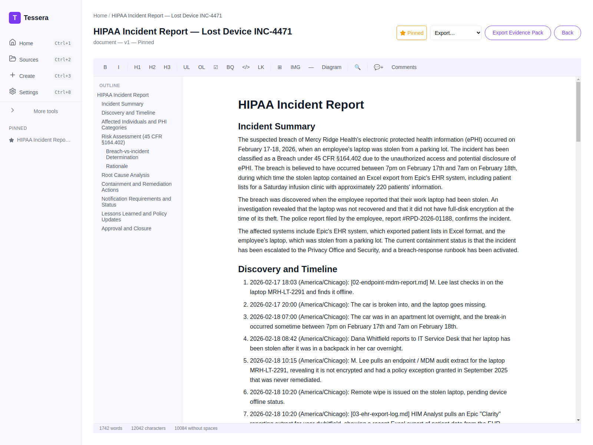
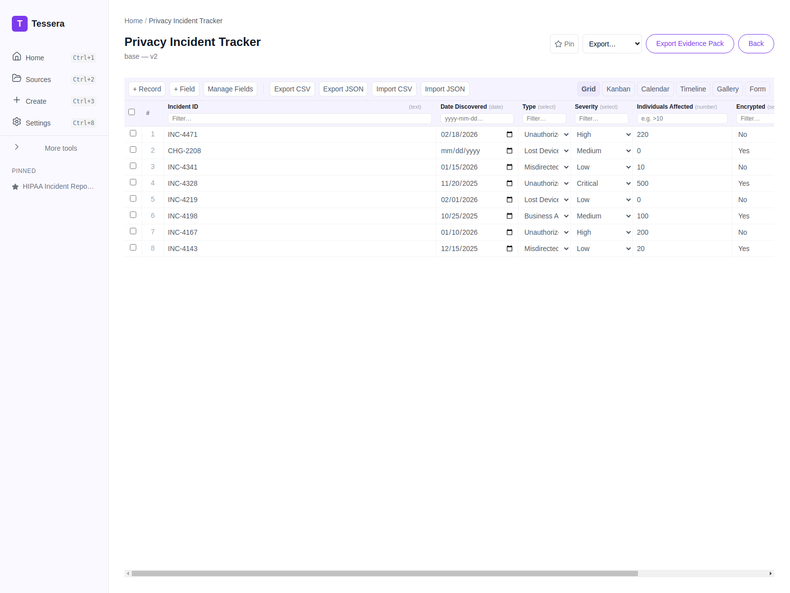

# Maya has five days and a stolen laptop: a defensible HIPAA breach assessment

*Part 1 of the Tessera showcase series — Healthcare.*

> **Persona:** Maya Okonkwo, Clinical Privacy Officer, Mercy Ridge Health (410-bed regional
> health system)
> **The task:** turn a stolen-laptop helpdesk ticket into a defensible four-factor HIPAA
> breach risk assessment within five business days.
> **Artifacts:** HIPAA Incident Report (document) + Privacy Incident Tracker (base)

## The situation

On a Tuesday morning, ticket **INC-4471** lands in Maya's queue: a nurse's work laptop was
stolen overnight from a car. The laptop held an Excel export from the EHR — a patient list
for a Saturday infusion clinic, roughly **220 patients**. The device was not encrypted; a
BitLocker policy exception from September had never been remediated.

Maya now has a regulatory clock running. Under the HITECH Act she needs a four-factor risk
assessment and a breach-vs-incident determination, and she has a few business days to
produce something a regulator — and her General Counsel — will accept.

The catch: the only way to write this report is to work *with* the most sensitive data in
the building. PHI. That material can never go to a cloud AI service. This is precisely the
constraint Tessera is built for.

## The inputs

Maya points Tessera at the folder for this incident. Four files:

- [`01-helpdesk-ticket-INC-4471.md`](../artifacts/healthcare/inputs/01-helpdesk-ticket-INC-4471.md) — the IT service-desk ticket and timeline.
- [`02-endpoint-mdm-report.md`](../artifacts/healthcare/inputs/02-endpoint-mdm-report.md) — the MDM/endpoint audit showing the device was unencrypted.
- [`03-ehr-export-log.md`](../artifacts/healthcare/inputs/03-ehr-export-log.md) — the Epic "Clarity" export log proving what data left the EHR.
- [`04-policy-and-context.md`](../artifacts/healthcare/inputs/04-policy-and-context.md) — the internal breach-response policy (POL-PRIV-014) and roles.

## The work

Maya picks the **HIPAA Incident Report** template and selects those four files as sources.
The template isn't a single prompt — it's a structured set of sections, each with its own
instruction. For the risk assessment section, Tessera sends the model this *verbatim*
prompt (from [`prompts/hipaa-incident-report.md`](../artifacts/healthcare/prompts/hipaa-incident-report.md)):

> Document the four-factor risk assessment required by the HITECH Act: (1) the nature and
> extent of the PHI involved, including types of identifiers and likelihood of
> re-identification; (2) the unauthorized person who used or received the PHI; (3) whether
> the PHI was actually acquired or viewed; (4) the extent to which risk has been mitigated.
> Conclude with the breach-vs-incident determination and the rationale.

The model drafts each section against Maya's four files only.

## The result

A complete, **12-section** incident report — Incident Summary, Discovery Timeline, Affected
Individuals & PHI Categories, the four-factor Risk Assessment, Root Cause Analysis,
Containment & Remediation, Notification Requirements, Lessons Learned, and Approval &
Closure. ~1,700 words, structured exactly the way a privacy officer would defend it.

Note the details that came straight from her sources: the **45 CFR §164.402** breach
classification, the ~220 affected patients, the police report number, the unencrypted-device
finding, and a notification-requirements table that distinguishes individual notice, HHS OCR
timing, and state obligations. The inline `[02-endpoint-mdm-report.md]`-style markers show
the model citing the source behind each claim.

The full generated document is in
[`outputs/hipaa-incident-report.md`](../artifacts/healthcare/outputs/hipaa-incident-report.md).

### The companion: a privacy incident tracker

Maya also needs to see this incident in the context of the others she's tracking. The same
sources, run through a **base** template, produce a structured Privacy Incident Tracker:

Eight records with typed fields — Incident ID, Date Discovered (date), Type / Severity /
Encrypted / Status (dropdown selects), and Individuals Affected (number). INC-4471 sits at
the top, classified, severity High, 220 individuals, unencrypted. The dropdowns carry the
real option sets derived from the data, so the grid behaves like a tool she'd actually
filter and sort. Source JSON: [`outputs/incident-tracker.json`](../artifacts/healthcare/outputs/incident-tracker.json).

## Why it matters

Maya's deliverable is a legal artifact. The value isn't "the AI wrote it" — it's that the
structure is enforced by the template (she can't accidentally skip the four-factor
analysis), every claim is traceable to a source file, and **the PHI never left her laptop**.
That combination is what makes an AI tool usable in healthcare compliance at all.

**Outcome:** Maya walks away with a 12-section, ~1,700-word report that covers all four HITECH
factors (the template makes skipping one impossible), a breach-vs-incident determination with
rationale ready for GC review, and an 8-record incident tracker with INC-4471 classified — every
claim traceable to one of four source files, the PHI never off her laptop, and the whole package
exportable as a PQC-signed evidence pack a regulator can verify.

---

Next: [David turns a 40-page SaaS contract into a one-page summary →](02-legal-paralegal.md)
