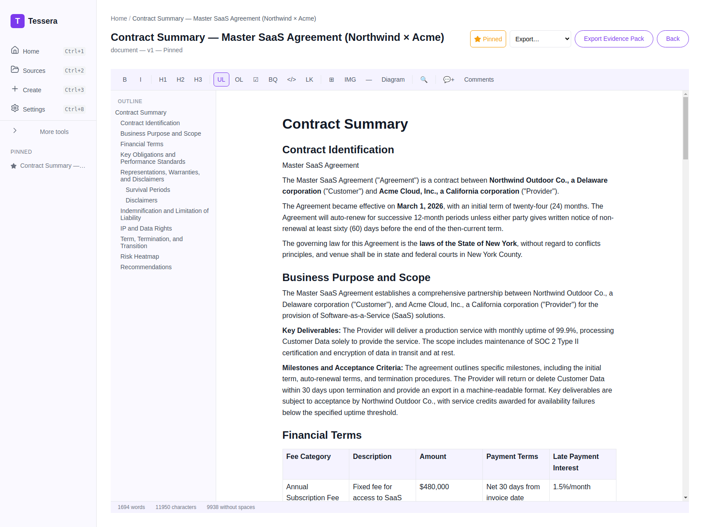
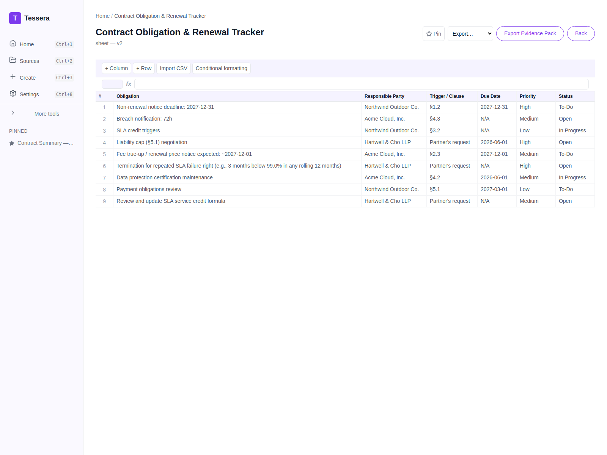

# David abstracts a SaaS agreement partners will actually trust

*Part 2 of the Tessera showcase series — Legal.*

> **Persona:** David Reyes, Corporate Paralegal, Hartwell & Cho LLP (mid-size corporate firm)
> **The task:** abstract an inbound commercial contract into a consistent one-page summary
> of parties, key terms, obligations, and risks — plus a tracker so no deadline lapses.
> **Artifacts:** Contract Summary (document) + Obligation & Renewal Tracker (sheet)

## The situation

A new **Master SaaS Agreement** between Northwind Outdoor Co. (customer) and Acme Cloud,
Inc. (provider) comes into the corporate group. Before a partner spends billable time on it,
David produces the firm's standard abstract: who the parties are, the commercial terms, the
obligations on each side, and — most importantly — a risk read on the clauses that bite.

The work is repetitive and high-stakes. Miss the auto-renewal notice window and the client
is locked in for another year. Misread the liability cap and the firm's advice is wrong.
Consistency is the product: every partner wants the summary in the same shape.

## The inputs

- [`01-master-saas-agreement.md`](../artifacts/legal/inputs/01-master-saas-agreement.md) — the full agreement text.
- [`02-reviewer-notes-and-redlines.md`](../artifacts/legal/inputs/02-reviewer-notes-and-redlines.md) — the supervising partner's notes and redline priorities.

## The work

David selects the **Contract Summary** template. Among its sections is a risk-analysis step.
The verbatim prompt Tessera runs (see [`prompts/contract-summary.md`](../artifacts/legal/prompts/contract-summary.md))
asks the model to identify the parties and key dates, summarize financial terms in a table,
extract each side's obligations, and produce a clause-level risk read grounded in the
agreement and the reviewer's notes.

## The result

A one-page-shaped abstract with everything a partner scans for: parties and governing law
(New York), the 24-month initial term with 60-day non-renewal notice, a **financial terms
table** ($480,000 annual subscription, late-payment interest, renewal escalator, service
credits), obligations split by party, and — the part partners actually read — a **risk
heatmap** rating each clause High/Medium/Low with a recommended action.

The model picked up the supervising partner's steer from the reviewer notes: the §5.1
liability cap is flagged **High**, with the recommendation to push from 1× to **2× annual
fees** for data-related claims. Inline `[01-master-saas-agreement.md]` markers tie the
representations and IP clauses back to the source. Full output:
[`outputs/contract-summary.md`](../artifacts/legal/outputs/contract-summary.md).

### The companion: an obligation & renewal tracker

The risks are only useful if someone acts on them in time. The same sources, run through a
**sheet** template, produce a deadline tracker:

Nine rows of obligations, each with the responsible party, the triggering clause (§1.2,
§4.3, §3.2 …), a due date, a priority, and a status. The non-renewal notice deadline
(2027-12-31), the breach-notification window, and the liability-cap negotiation all become
trackable line items. Source JSON:
[`outputs/obligation-tracker.json`](../artifacts/legal/outputs/obligation-tracker.json).

## Why it matters

The template guarantees the abstract is always in the firm's house format, so partners build
trust in it. The clause-level citations mean a partner can jump from "this is risky" to the
exact contract language in one click. And the tracker turns a static summary into a live
checklist of dates that can't be allowed to slip — the failure mode that actually costs
clients money.

---

Next: [Priya builds a credit memo the committee can interrogate →](03-commercial-credit-officer.md)
