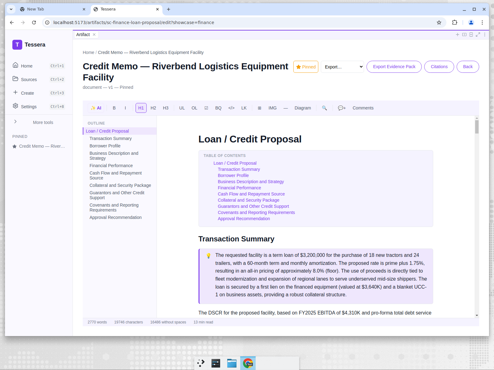
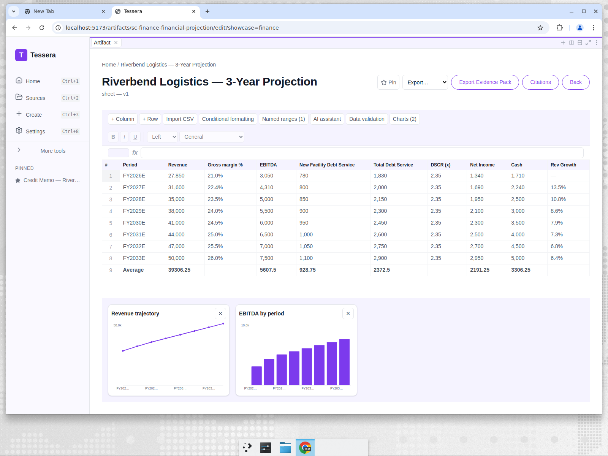

# Priya turns borrower financials into a credit memo the committee can interrogate

*Part 3 of the Tessera showcase series — Finance.*

> **Persona:** Priya Nair, Commercial Credit Officer, Cascade Regional Bank
> **The task:** assemble a credit memo that ties a borrower's financials, collateral, and
> risks to a clear recommendation — plus a multi-year projection the credit committee can
> challenge.
> **Artifacts:** Credit Memo (document) + 3-Year Projection (sheet)

## The situation

Riverbend Logistics LLC, a regional less-than-truckload carrier, wants a **$3.2M equipment
term loan** to replace aging tractors and trailers and add two regional lanes. Priya has to
underwrite it: pull the financials into a coherent story, assess the collateral, size the
risk, and land on a recommendation the credit committee can poke holes in.

Credit memos are unforgiving. Every ratio has to reconcile to the financials. Every
covenant has to be justified. "Trust me" is not a section heading.

## The inputs

- [`01-borrower-financials.md`](../artifacts/finance/inputs/01-borrower-financials.md) — three years of revenue, EBITDA, leverage, and coverage figures.
- [`02-market-and-risk-notes.md`](../artifacts/finance/inputs/02-market-and-risk-notes.md) — collateral detail, market context, and the bank's risk notes.

## The work

Priya picks the **Loan / Credit Proposal** template and selects both files. The template
walks the standard credit-memo structure; one section prompt (see
[`prompts/loan-proposal.md`](../artifacts/finance/prompts/loan-proposal.md)) asks the model
to lay out the transaction summary with the facility type, amount, term, pricing, and use of
proceeds, grounded in the source figures.

## The result

A full credit memo: Transaction Summary (Equipment Term Loan, $3,200,000, 60 months, Prime +
1.75% with an 8.0% floor), Borrower Profile, Business Description, a three-year **Financial
Performance table**, Cash Flow & Repayment analysis with base and downside scenarios,
Collateral & Security package, Guarantors, a **Covenants table** (Debt/EBITDA cap,
fixed-charge coverage floor, minimum liquidity), Risk Rating, and an Approval Recommendation.

The numbers trace back to the source files with `[01-borrower-financials.md]` and
`[02-market-and-risk-notes.md]` markers — the LTV at funding, the DSCR threshold of 1.25x,
the appraised collateral values. A **callout** leads the memo, a **table-of-contents block**
and the scroll-tracked **outline panel** (with a reading-time estimate) make the long memo
navigable, and the on-device AI assistant is on hand to tighten any section. Full output:
[`outputs/loan-proposal.md`](../artifacts/finance/outputs/loan-proposal.md).

### The companion: a 3-year projection

The committee will want to stress the forward numbers, so Priya generates the projection as
a **sheet**:

Revenue ($32.2M → $34.3M → $36.5M), gross margin (22.1% → 24.0%), EBITDA, new-facility debt
service, total debt service, DSCR (2.40x → 2.60x), net income, and cash, laid out across
FY2026E–FY2028E. The sheet exercises the full spreadsheet surface: a derived **Rev Growth**
formula column (`=(B3-B2)/B2`), an **AVERAGE summary row** over every numeric series, a
named **`Revenue`** range, a **frozen header**, and two **range-bound charts** — a *Revenue
trajectory* line and an *EBITDA by period* bar — both bound to the model's own values and
excluding the summary row. It's a grid the committee can edit and re-run assumptions
against, not a static paragraph. Source JSON:
[`outputs/financial-projection.json`](../artifacts/finance/outputs/financial-projection.json).

## Why it matters

A credit memo lives or dies on traceability. When a committee member asks "where's the 2.6x
DSCR coming from?", Priya can point at the projection row and the source figure behind it.
The template enforces that every memo covers collateral, covenants, and downside scenarios —
so nothing structurally important gets skipped under deadline pressure. And the borrower's
financials, like all the sensitive material in this series, stay on the bank's machine.

**Outcome:** Priya produces a structured credit memo plus a FY2026E–FY2028E projection grid
(revenue $32.2M→$36.5M, DSCR 2.40x→2.60x) the committee can edit and re-run — every figure
traceable to its source row, collateral/covenants/downside scenarios guaranteed present by the
template, and the borrower's NPI never sent to a vendor cloud.

---

Next: [Sofia turns program notes into a funder-ready grant proposal →](04-nonprofit-development-director.md)
