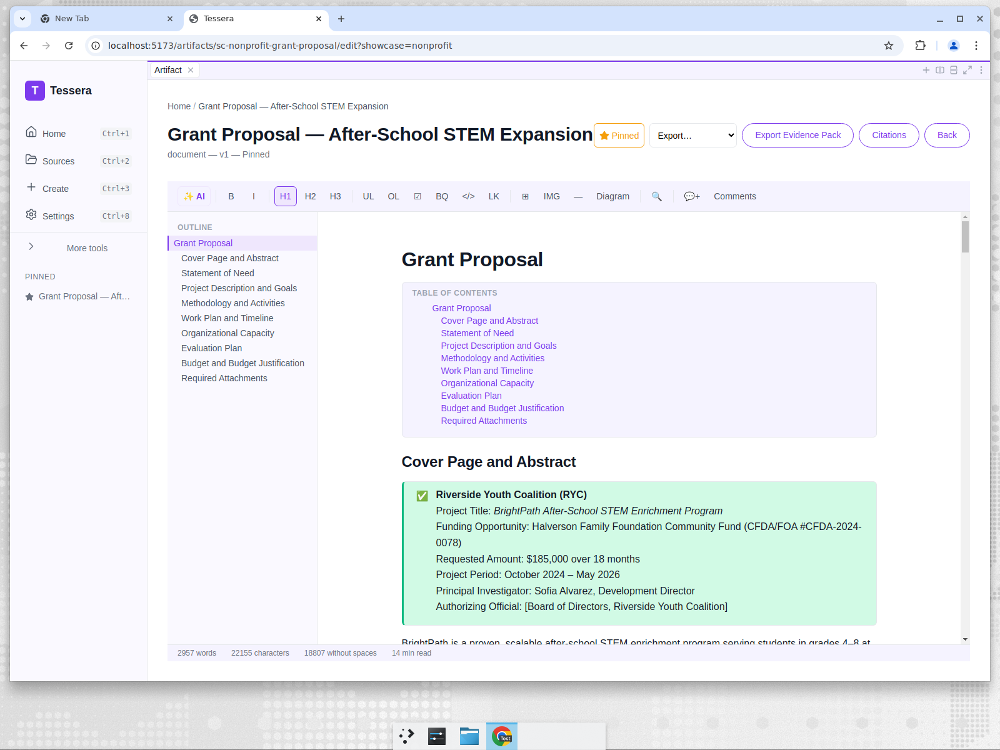
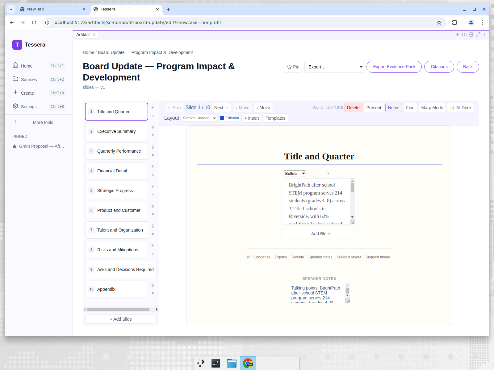

# Sofia turns messy program notes into a funder-ready grant proposal

*Part 4 of the Tessera showcase series — Nonprofit.*

> **Persona:** Sofia Alvarez, Development Director, Riverside Youth Coalition
> **The task:** turn scattered program notes and outcomes data into a funder-ready grant
> proposal, then report impact back to the board.
> **Artifacts:** Grant Proposal (document) + Board Update (slides)

## The situation

Riverside Youth Coalition runs **BrightPath**, an after-school STEM program for low-income
students in grades 4–8 at three Title I schools. The Halverson Family Foundation has an open
RFP, and Sofia wants to ask for **$185,000 over 18 months** to expand the program. There's a
waitlist of 96 students; the case for funding is real. But the proposal has to follow the
funder's structure exactly, and Sofia's raw material is a pile of program notes and outcomes
numbers.

Development directors live this tension: the impact is genuine, but the time to package it
into a compliant proposal competes directly with the time to actually run programs.

## The inputs

- [`01-program-notes-and-outcomes.md`](../artifacts/nonprofit/inputs/01-program-notes-and-outcomes.md) — attendance, math-proficiency gains, caregiver survey results, staffing.
- [`02-funder-rfp-and-board-context.md`](../artifacts/nonprofit/inputs/02-funder-rfp-and-board-context.md) — the Halverson RFP priorities and board strategic context.

## The work

Sofia selects the **Grant Proposal** template and both source files. The template mirrors a
standard funder application; one section prompt (see
[`prompts/grant-proposal.md`](../artifacts/nonprofit/prompts/grant-proposal.md)) asks the
model to write the Statement of Need, grounding it in the program's outcomes data and aligning
it to the funder's stated priorities.

## The result

A complete, ~2,000-word proposal in the funder's expected shape: Cover Page & Abstract,
Statement of Need, Project Description & SMART Goals, Methodology & Activities, a **Work Plan
& Timeline table**, Organizational Capacity, Evaluation Plan, a multi-year **Budget table**
(personnel, equipment, supplies, indirect), Sustainability Plan, and Required Attachments.

The numbers come straight from Sofia's notes: the 78% attendance rate, the +11 percentile
math gain, the 96-student waitlist, the enrollment target of 214 → 360, the $185,000 ask. The
abstract explicitly ties the program to the Halverson Foundation's priority of closing the
STEM opportunity gap. A success **callout** opens the proposal, a **table-of-contents block**
and the scroll-tracked **outline** keep a ten-section document navigable, and the on-device
AI assistant can expand or re-tone any section. Full output:
[`outputs/grant-proposal.md`](../artifacts/nonprofit/outputs/grant-proposal.md).

### The companion: a board update deck

The board funds the strategy and wants the story, not the 20-page proposal. The same context,
run through a **slides** template, becomes a board deck:

Ten slides — Title, Executive Summary, Quarterly Performance, Financial Detail, Strategic
Progress, Product & Customer, Talent & Organization, Risks & Mitigations, Asks & Decisions
Required, and Appendix. The deck runs through the slide editor's **layout engine** (a
*Section Header* opener followed by *Title + Content* layouts), wears the **Editorial**
theme, and carries **speaker notes** on every slide — so Sofia can rehearse in **present
mode** (a fullscreen second window with her notes) straight from the generated deck. Source
JSON: [`outputs/board-update.json`](../artifacts/nonprofit/outputs/board-update.json).

## Why it matters

For a small development team, the bottleneck isn't ideas — it's turnaround. Tessera takes the
outcomes data Sofia already has and shapes it into both the long-form proposal a funder
requires *and* the short-form deck a board expects, from the same grounded sources. The
budget tables and SMART goals are structured by the template, so the proposal is complete on
the first pass instead of bouncing back for missing sections.

**Outcome:** From one set of program notes and outcomes data, Sofia gets both a funder-ready
grant proposal and a ten-slide board deck — the long form a funder requires and the short form a
board expects, grounded in the same sources so the numbers can't drift between them. Complete on
the first pass, with every figure cited back to the data she already had.

---

Next: [Marcus runs a QBR off real pipeline data →](05-retail-sales-ops-lead.md)
