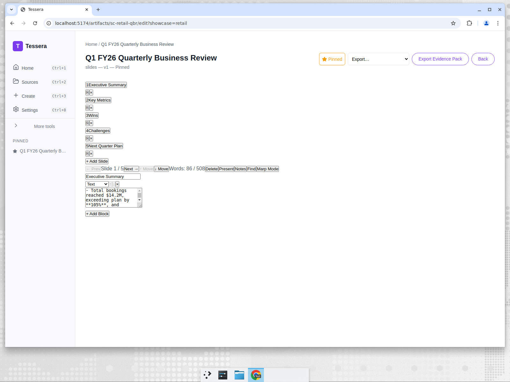
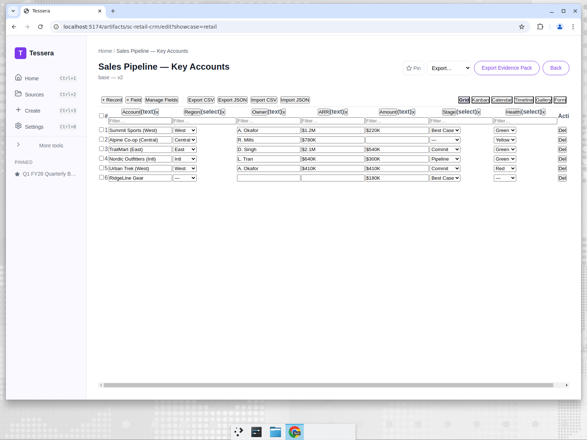

# Marcus runs a QBR off real pipeline data — and a CRM the team can act on

*Part 5 of the Tessera showcase series — Retail / Consumer Goods.*

> **Persona:** Marcus Chen, Sales Operations Lead, Northwind Outdoor Co.
> **The task:** consolidate pipeline, performance, and account health into a quarterly
> business review deck and a clean CRM view the team can act on.
> **Artifacts:** QBR Deck (slides) + CRM (base)

## The situation

It's the end of Q1 FY26 at Northwind Outdoor Co., and Marcus owns the quarterly business
review. He has a sales-data export and a pile of account notes. Leadership wants a tight
story: how did we do against plan, what won, what's at risk, and what's the plan for next
quarter. The sales team wants something different — a CRM view they can actually filter and
work, not a slide they'll never open again.

Sales ops is the translation layer between raw numbers and decisions. The QBR has to be
honest about the soft spots (a thin pipeline) while still landing the wins.

## The inputs

- [`01-quarterly-sales-data.md`](../artifacts/retail/inputs/01-quarterly-sales-data.md) — bookings, growth, margin, and regional performance.
- [`02-key-accounts-and-deals.md`](../artifacts/retail/inputs/02-key-accounts-and-deals.md) — the key accounts, deal stages, and account-health notes.

## The work

Marcus picks the **QBR** slides template and selects both files. One section prompt (see
[`prompts/qbr.md`](../artifacts/retail/prompts/qbr.md)) asks the model to write an executive
summary of the quarter grounded in the sales data and account notes.

## The result

A five-slide QBR — Executive Summary, Key Metrics, Wins, Challenges, and Next Quarter Plan —
with cited, decision-ready bullets. The opening summary leads with the numbers that matter:
bookings of **$14.2M (105% of plan, +12% YoY)**, the West region carrying the quarter,
Central lagging on risk from a key account, Q2 pipeline coverage light at **1.6x**, and gross
margin up 150bps on an apparel mix shift. Each bullet carries a `[01-quarterly-sales-data.md]`
or `[02-key-accounts-and-deals.md]` citation. The deck is built with the slide editor's
**layout engine** (a *Section Header* opener into *Title + Content* slides), wears the
**Aurora** theme, and carries **speaker notes** on every slide for rehearsal in **present
mode**. Before it goes to leadership, Marcus applies Northwind's **Brand Kit** — company
colours, fonts, and logo — in one click; the brand re-skins every slide and **survives the
PPTX / PDF export** so the deck looks on-brand wherever it's opened, and he saves it as a
portable brand pack (`tessera.brandpack`) to reuse next quarter. Source JSON:
[`outputs/qbr.json`](../artifacts/retail/outputs/qbr.json).

### The companion: a working CRM

The deck tells the story; the **base** gives the team something to work:

This is a **two-table CRM**, not a flat list. The **Accounts** table holds the key accounts
with typed fields — Account, Region/Stage/Health **dropdown selects** (West/Central/East/Intl;
Best Case/Commit/Pipeline; Green/Yellow/Red), ARR, and a **Health Score rating** — and links
each account to an **Owner** in a second **Sales Reps** table. From that link the grid derives
a **Rep Region lookup**, while the Sales Reps table **rolls up** each rep's account count and
total pipeline ARR. Opening a record brings up the **expand-record modal** with a comments
timeline on the lead strategic account. It's a CRM the team can filter by health, group by
owner, and actually work — not a static table. Source JSON:
[`outputs/crm.json`](../artifacts/retail/outputs/crm.json).

To hand it to the team, Marcus flips the base into **App mode**. The same records become a
lightweight internal CRM app: an app-shell sidebar across Accounts and Sales Reps, a
**record-detail page** a rep opens to read and update one account, a runtime **form** to add a
new account or log a change without seeing the schema, and a **dashboard** of account counts
and pipeline-ARR rollups by region. No export to a SaaS CRM and no schema migration — the same
grounded base, now an app the team can operate.

## Why it matters

The same two source files produce both the narrative artifact for leadership and the
operational artifact for the team — consistent because they're grounded in the same data. The
citations mean that when someone challenges the "105% of plan" headline, Marcus can point at
the export row. And because the pipeline-coverage weakness came straight from the data rather
than from spin, the QBR is the kind leadership can actually make decisions on.

**Outcome:** Two source files yield both a leadership QBR deck and an operational CRM base with
typed, filterable fields (Region, Stage, Health as real dropdown option sets) — narrative and
operating view kept consistent because they share the same grounded data. When someone
challenges the "105% of plan" headline, Marcus points at the export row instead of defending a
vibe.

---

Next: [How the Create flow and editors actually work →](06-ui-ux-walkthrough.md)
