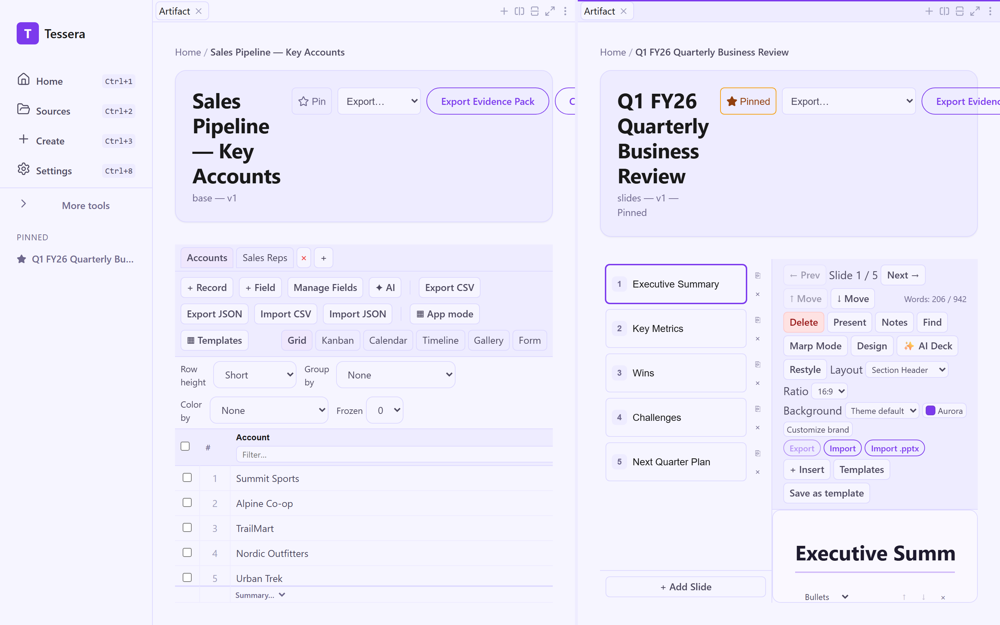

# From blank screen to source-cited artifact: the Create flow and editors

_Part 6 of the Tessera showcase series — UI/UX._

The five persona stories all share the same path through the product. This post walks that
path — from the home screen to a finished, source-cited artifact — and shows why each step is
designed the way it is.

Tessera's interface has been rebuilt around a single, familiar design language: **KChat's**
confident, low-friction look and feel. The palette is built on KChat's soft lavender page
surface, warm near-black text, and a deep purple accent that carries every primary action. The
result is a workspace that feels closer to a polished consumer app than a power-user tool —
which matters when the user is a clinical privacy officer, a paralegal, or a sales-ops lead who
needs to get work done, not learn a new UI.

## The home screen

The sidebar is deliberately short. The primary navigation is just **Home, Sources, Create, and
Settings** — the four things a new user needs — with power-user tools (Templates, Tasks,
Automations, Vision, Memory) tucked under an expandable **"More tools"** section. A non-technical
SME shouldn't have to parse eight nav items to make their first document.

The page header is now a contained hero card: a soft surface with rounded corners and a clear
primary action, so the user always knows what to do next. Recent and pinned artifacts sit on the
home screen so returning to work is one click. A fresh install sees a welcoming empty state with
a large, friendly icon and a direct "Add Source" / "Explore Templates" choice — no dead ends.

## Step 1 — "What do you need?"

Create doesn't open onto all 287 templates at once. It opens onto a single question — _what do you need?_
— with four large, rounded cards: write a document, make a presentation, track data in a
spreadsheet, or build a database. Each card is a clear intent, not a technical artifact type.

This is intent-based progressive disclosure: the user declares the _shape_ of the outcome before
they're asked to choose among specifics. The KChat-inspired card surfaces, pill-shaped buttons,
and generous spacing keep the screen calm even though the underlying template library is large.

## Step 2 — a curated shortlist

Having picked an intent, the user sees a curated handful of templates for that artifact type —
not the full library. PRD, Proposal, SOP, Report, Meeting Notes for documents; QBR, Strategy,
Pitch for slides; and so on. A "Show all templates" affordance reveals the full catalog —
**287 English templates** (530 including the nine localized locales) — for power users who know
exactly what they want, with **industry, language, and country / jurisdiction filters** to
narrow it fast.

The whole gallery is **derived from the template registry**: dropping a new template YAML into
the library surfaces a filterable card automatically, with no UI change. New users get a
confident shortlist; experts keep the firehose. Each template is the same structured object the
personas used — a set of sections, each with its own grounded prompt.

## Step 3 — choose sources

This is the step that makes Tessera Tessera. Before anything is generated, the user chooses
_what the model is allowed to see_ — local folders that have been indexed, and any explicitly
connected cloud sources from a catalog of **33 read-only, least-privilege connectors** (Google
Drive, OneDrive/SharePoint, Dropbox, Box, Notion, Confluence, Jira, Linear, Asana, ClickUp,
GitHub/GitLab, HubSpot, Salesforce, Zendesk, ServiceNow, Intercom, Figma, Miro, Slack, Teams,
Zoom, and more). The gallery is **searchable and grouped by category** (Storage, Docs & Wiki,
Chat, CRM, Issues, Mail, Calendar & Meetings, Design, Code), and every card carries a
connected/disconnected state and a **"what we read / what we never touch"** scope disclosure.
Cloud connectors are opt-in and read-only. Nothing is generated from data the user didn't
deliberately select.

This is also the local-first guarantee made visible: the index is on the machine, the model
runs on the machine, and the sources are folders the user pointed at. For Maya's PHI and
Priya's borrower financials, this screen _is_ the compliance story.

## Step 4 — the editor

Once generated, the artifact opens in a real editor matched to its type. Across the five
personas you've now seen all four:

- **Document** (Maya's HIPAA report, David's contract summary, Priya's credit memo, Sofia's
  grant proposal) — _Google-Docs / Notion level._ A rich-text editor with **callout**,
  **toggle**, and **table-of-contents** blocks, a scroll-tracked **outline panel** with a
  **reading-time** estimate, inline tables, resolvable **inline comments** (author,
  timestamp, resolved state, side panel), and an on-device **AI writing assistant**
  (rewrite / shorten / expand / change-tone / translate / continue, plus Ask-AI with a
  word-diff preview). The outline is what makes a 12-section compliance report navigable. An
  in-editor **template gallery** lets the author start from a structured starter and save the
  finished structure back as a reusable template — a portable `tessera.doctemplate` file the
  team can share.
- **Sheet** (David's obligation tracker, Priya's projection) — _Google-Sheets level._ A
  spreadsheet grid with a real formula engine (**160+ functions**), **named ranges**, **data
  validation** (dropdown / checkbox), rule-based **conditional formatting**, **range-bound
  charts** (bar / line / pie), **pivot tables**, a virtual-scrolling grid that stays smooth
  at 10K+ rows, **freeze panes**, **chart-from-selection**, locale-aware number formats,
  CSV / XLSX import-export, an in-editor **template gallery** with save-as-template (portable
  `tessera.sheettemplate`), and an AI assistant for NL→formula / explain / fix.
- **Base** (Maya's incident tracker, Marcus's CRM) — _Airtable level._ A multi-table database
  with **cross-table linked records** carrying **lookup** and **rollup** fields, typed fields
  (text, date, number, checkbox, rating, **select dropdowns** with real option sets, formula),
  an **expand-record modal** with **comments + activity**, grid **group-by / row-height /
  frozen-columns**, six views (Grid / Kanban / Calendar / Timeline / Gallery / Form), a
  **template gallery** with save-as-template (portable `tessera.basetemplate`), and a
  builder⇄**App mode** (covered below) — plus on-device AI for schema-gen / NL→formula /
  column-fill.
- **Slides** (Sofia's board deck, Marcus's QBR) — _Google-Slides / Gamma level._ A deck editor
  with a smart **layout engine** (timeline / process / comparison / gallery / metric), a **deck
  template gallery** + insert-card presets with save-as-template (portable
  `tessera.slidetemplate`), richer **themes** with a visual picker, a **Brand Kit** that
  re-skins the deck (colours / fonts / logo / background) and travels as a portable brand pack
  (`tessera.brandpack`) — even **imported from an existing `.pptx`** — with the brand surviving
  **PPTX / PDF / HTML** export, a slide navigator, per-slide content blocks, a WYSIWYG
  **Design** view, a one-click **Restyle**, **speaker notes**, a **presenter mode** (a
  fullscreen second window with notes), AI deck generation, and a raw Marp markdown mode.

Every editor exports to the formats that matter for that artifact — Markdown / HTML / PDF /
DOCX for documents, CSV / XLSX for sheets and bases, PPTX for slides. Documents and bases
also offer **Export Evidence Pack** (visible in the editor header above): a single ZIP that
bundles the artifact, the source files it cited, and a **post-quantum provenance signature**
(ML-DSA-65 / FIPS 204) so a recipient — a regulator, an auditor, a credit committee — can
verify the package wasn't altered after it left the author's machine.

## Base App mode — from table to internal app

A base isn't only a grid to maintain — it's often the data behind a small internal tool. Every
base now carries a builder⇄**App** toggle. Flip to **App** and the same records become a
lightweight application: an **app-shell navigation** derived from the schema, a **record-detail
page** for reading and editing one record at a time, runtime **data-entry forms** that create
records (the fillable Form view, now a first-class entry surface), and a **summary dashboard**
of counts and rollups over existing fields. It's renderer-only and additive — legacy bases open
unchanged with no schema-version bump — so Maya's privacy-incident tracker becomes an
intake-and-triage app, and Marcus's CRM becomes something the team can operate, not just edit.

## The AI underneath — a deliberate Skills engine

The generation in every persona story isn't a single prompt-and-pray call. Tessera runs AI as a
**deliberate, multi-step Skills engine** built for small on-device models: each skill is an
ordered sequence of steps, and every step carries a **deterministic output check** with
**bounded auto-repair** (a failed check re-prompts a fixed number of times rather than shipping
a bad section), **per-step model sampling**, and a **per-step output-format contract**. That is
how a 1.7B–8B model produces a structured 12-section report or a typed base schema reliably
instead of drifting. Skills are **user-authorable** — you can write your own multi-step skill
with your own checks and formats — and **portable**, exported and imported as `tessera.skill`
files so a team can standardize on the same deliberate workflow.

## The workspace — work two artifacts at once

Artifacts don't each take over the window. Tessera's workspace is an **Obsidian-style
split-pane + tabbed** surface: every editor header carries **New tab**, **Split right**, and
**Split down** controls, panes resize with a draggable handle, and the layout (which tabs are
open in which panes) is **restored on next launch**. Below, Marcus has his **CRM base** open
on the left and the **QBR deck** on the right — the operational view and the narrative view
side by side, from the same grounded data.

## Step 5 — the knowledge substrate underneath

Indexing isn't just "throw text in a search box." On ingest, Tessera's knowledge substrate
extracts structured **observations** (entities, facts, decisions, tasks) from your sources,
scores them with a decay-based **memory** model, and links recurring entities into a
**concept graph** across the files they co-occur in. That substrate then feeds three places
you can see and control today.

**Search you can tune.** Settings → Search exposes how retrieval ranks hits: a **hybrid**
toggle that blends lexical (BM25) and semantic (vector) scoring, and a **temporal decay**
control with an adjustable recency half-life so freshly-edited sources outrank stale ones at
equal content relevance. The embedding model that powers semantic search is selectable in the
same screen — a zero-download lexical embedder for offline/privacy-strict setups, or a
downloadable multilingual model when the corpus isn't pure English.

**Source health and zero-config backup.** The same Settings page surfaces a **Source Health**
table (per-source last-sync, health, chunk count, storage) and a **Backup & Recovery** card:
automatic local hot-copy backups on a schedule, retention pruning, one-click "Back up now,"
restore from any recent snapshot, and encrypted workspace-bundle export/import. Because it
uses SQLite's Online Backup API against the encrypted single-file store (and its substrate
sibling DBs), backups are consistent and never leave the machine unless you export a bundle.

The home screen carries a quiet freshness signal from the same system — a **"Last backup"**
line and live source-status counts — so a returning user knows their work is protected
without opening Settings.

A full walk through the knowledge plane — what gets extracted, how memory retention and the
concept graph behave, and the surfaces that browse it (the Memory page, concept-graph panel,
and enriched "Knowledge" citation tab) — is the [next post](07-knowledge-plane.md).

## The thing that ties it together: provenance

Throughout the generated artifacts you see inline markers like `[02-endpoint-mdm-report.md]`.
Those aren't decoration — they're Tessera citing the source file behind each claim. Combined
with the "choose sources" step, this closes the loop that most AI tools leave open: you
control exactly what the model can see, and the output tells you exactly what it used.

That's the whole arc — _what do you need → from which sources → here's the draft, and here's
where every line came from_ — and it's the same arc whether you're filing a breach assessment
or building a sales QBR. The KChat theme just makes the journey feel as approachable as the
product is serious.

---

Next: [The knowledge plane — what Tessera extracts and remembers →](07-knowledge-plane.md) ·
or back to the [series introduction](00-introduction.md) / [showcase index](../README.md)
