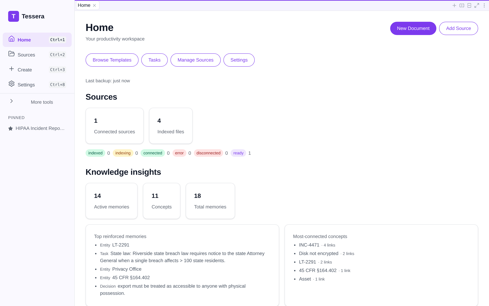
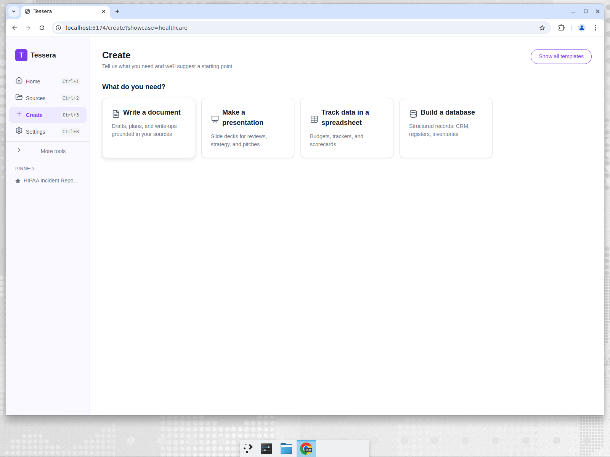
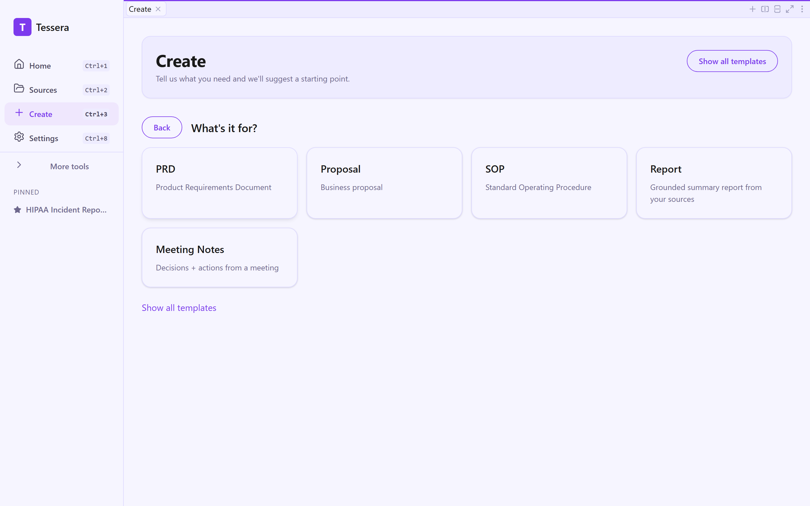
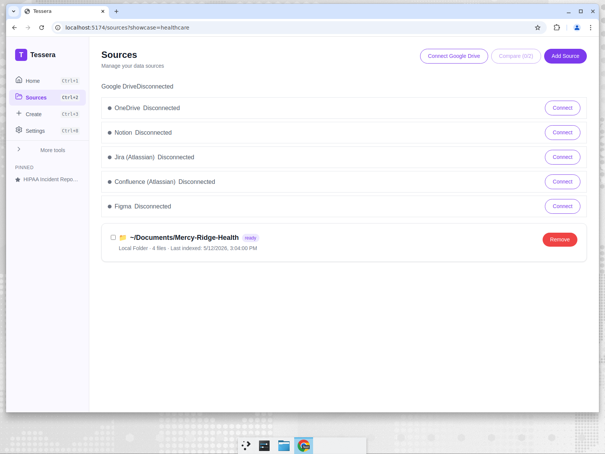

# From blank screen to source-cited artifact: the Create flow and editors

*Part 6 of the Tessera showcase series — UI/UX.*

The five persona stories all share the same path through the product. This post walks that
path — from the home screen to a finished, source-cited artifact — and shows why each step is
designed the way it is.

## The home screen

The sidebar is deliberately short. After a recent progressive-disclosure pass, the primary
navigation is just **Home, Sources, Create, and Settings** — the four things a new user needs
— with power-user tools (Templates, Tasks, Automations, Vision) tucked under an expandable
"More tools" section. A non-technical SME shouldn't have to parse eight nav items to make
their first document. Recent and pinned artifacts sit on the home screen so returning to work
is one click.

## Step 1 — "What do you need?"

Create doesn't open onto 170+ templates. It opens onto a single question — *what do you need?*
— with four large choices: write a document, make a presentation, track data in a
spreadsheet, or build a database. This is intent-based progressive disclosure: the user
declares the *shape* of the outcome before they're asked to choose among specifics.

## Step 2 — a curated shortlist

Having picked an intent, the user sees a curated handful of templates for that artifact type —
not the full library. PRD, Proposal, SOP, Report, Meeting Notes for documents; QBR, Strategy,
Pitch for slides; and so on. A "Show all templates" affordance reveals the full 170+ for power
users who know exactly what they want. New users get a confident shortlist; experts keep the
firehose. Each template is the same structured object the personas used — a set of sections,
each with its own grounded prompt.

## Step 3 — choose sources

This is the step that makes Tessera Tessera. Before anything is generated, the user chooses
*what the model is allowed to see* — local folders that have been indexed, and any explicitly
connected cloud sources (Google Drive, OneDrive/SharePoint, Notion, Jira, Confluence, Figma).
Cloud connectors are opt-in and show a clear connected/disconnected state. Nothing is
generated from data the user didn't deliberately select.

This is also the local-first guarantee made visible: the index is on the machine, the model
runs on the machine, and the sources are folders the user pointed at. For Maya's PHI and
Priya's borrower financials, this screen *is* the compliance story.

## Step 4 — the editor

Once generated, the artifact opens in a real editor matched to its type. Across the five
personas you've now seen all four:

- **Document** (Maya's HIPAA report, David's contract summary, Priya's credit memo, Sofia's
  grant proposal): a rich-text editor with a live **outline panel** built from the headings,
  inline tables, and a full formatting toolbar. The outline is what makes a 12-section
  compliance report navigable.
- **Sheet** (David's obligation tracker, Priya's projection): a spreadsheet grid with typed
  columns, add row/column, CSV/JSON import-export, and conditional formatting.
- **Base** (Maya's incident tracker, Marcus's CRM): a database with typed fields — text,
  date, number, and **select dropdowns** carrying real option sets — plus Grid, Kanban,
  Calendar, Timeline, Gallery, and Form views.
- **Slides** (Sofia's board deck, Marcus's QBR): a deck editor with a slide navigator,
  per-slide content blocks (text, bullets, diagram, image), speaker notes, a presenter mode,
  and a raw Marp markdown mode.

Every editor exports to the formats that matter for that artifact — Markdown / HTML / PDF /
DOCX for documents, CSV / XLSX for sheets and bases, PPTX for slides. Documents and bases
also offer **Export Evidence Pack** (visible in the editor header above): a single ZIP that
bundles the artifact, the source files it cited, and a **post-quantum provenance signature**
(ML-DSA-65 / FIPS 204) so a recipient — a regulator, an auditor, a credit committee — can
verify the package wasn't altered after it left the author's machine.

## Step 5 — the knowledge substrate underneath

Indexing isn't just "throw text in a search box." On ingest, Tessera's knowledge substrate
extracts structured **observations** (entities, facts, decisions, tasks) from your sources,
scores them with a decay-based **memory** model, and links recurring entities into a
**concept graph** across the files they co-occur in. That substrate then feeds three places
you can see and control today.

**Search you can tune.** Settings → Search exposes how retrieval ranks hits: a **hybrid**
toggle that blends lexical (BM25) and semantic (vector) scoring, and a **temporal decay**
control with an adjustable recency half-life so freshly-edited sources outrank stale ones at
equal content relevance. The embedding model that powers semantic search is selectable in
the same screen — a zero-download lexical embedder for offline/privacy-strict setups, or a
downloadable multilingual model when the corpus isn't pure English.

**Source health and zero-config backup.** The same Settings page surfaces a **Source Health**
table (per-source last-sync, health, chunk count, storage) and a **Backup & Recovery** card:
automatic local hot-copy backups on a schedule, retention pruning, one-click "Back up now,"
restore from any recent snapshot, and encrypted workspace-bundle export/import. Because it
uses SQLite's Online Backup API against the encrypted single-file store (and its substrate
sibling DBs), backups are consistent and never leave the machine unless you export a bundle.

The home screen carries a quiet freshness signal from the same system — a **"Last backup"**
line and live source-status counts — so a returning user knows their work is protected
without opening Settings.

A full walk through the knowledge plane — what gets extracted, how memory retention and the
concept graph behave, and the shipping surfaces that browse it (the Memory page, concept-graph
panel, and enriched "Knowledge" citation tab) — is the [next post](07-knowledge-plane.md).

## The thing that ties it together: provenance

Throughout the generated artifacts you see inline markers like `[02-endpoint-mdm-report.md]`.
Those aren't decoration — they're Tessera citing the source file behind each claim. Combined
with the "choose sources" step, this closes the loop that most AI tools leave open: you
control exactly what the model can see, and the output tells you exactly what it used.

That's the whole arc — *what do you need → from which sources → here's the draft, and here's
where every line came from* — and it's the same arc whether you're filing a breach assessment
or building a sales QBR.

---

Next: [The knowledge plane — what Tessera extracts and remembers →](07-knowledge-plane.md) ·
or back to the [series introduction](00-introduction.md) / [showcase index](../README.md)
