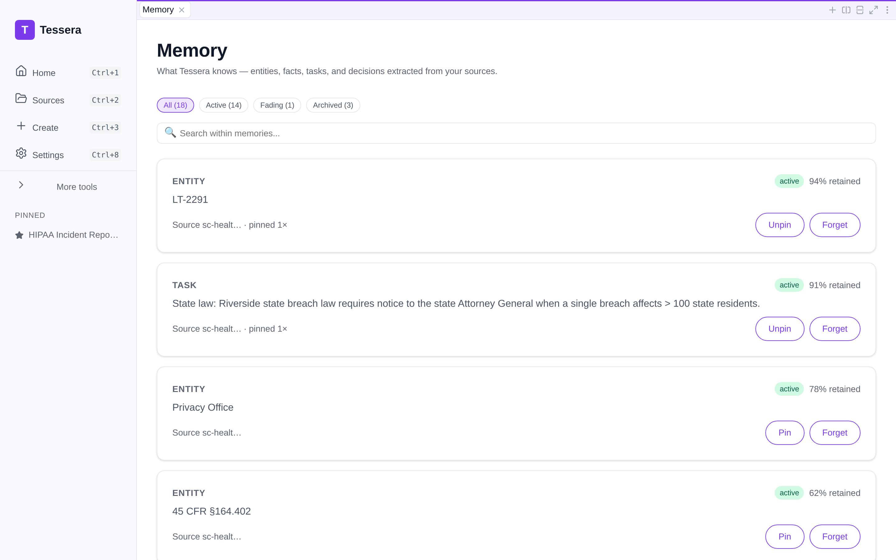
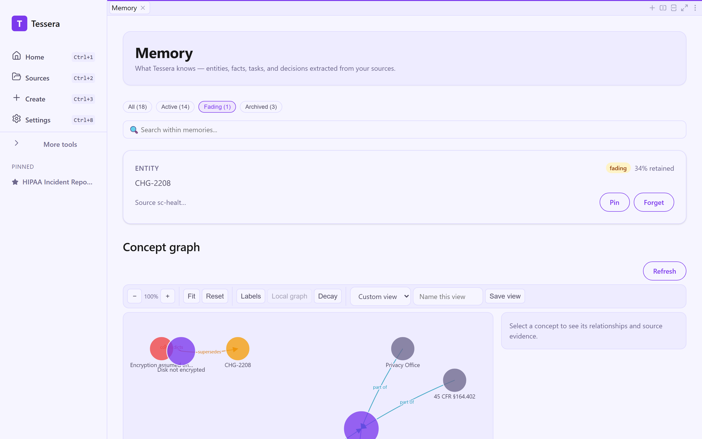
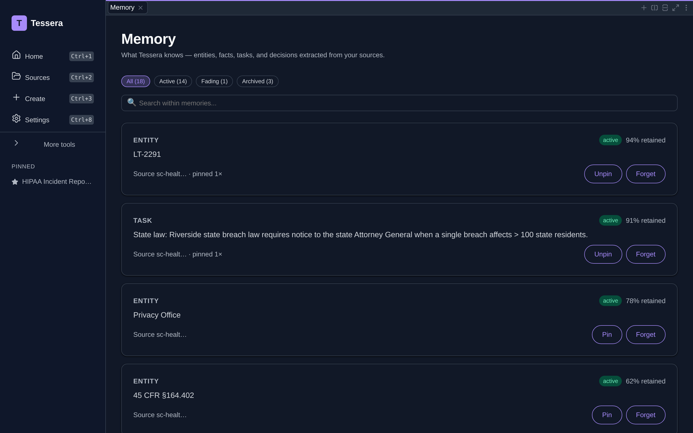
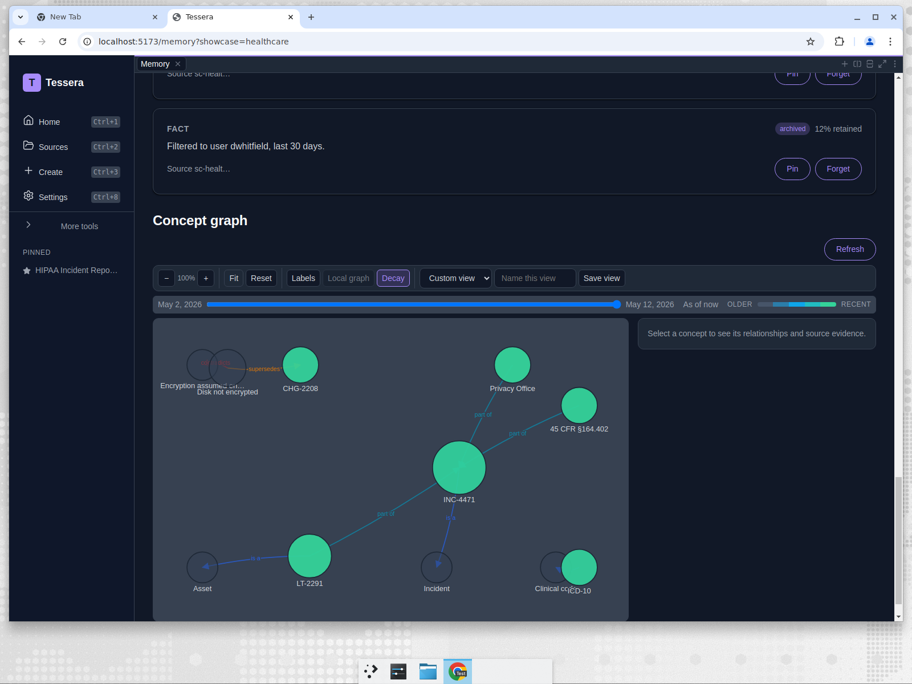
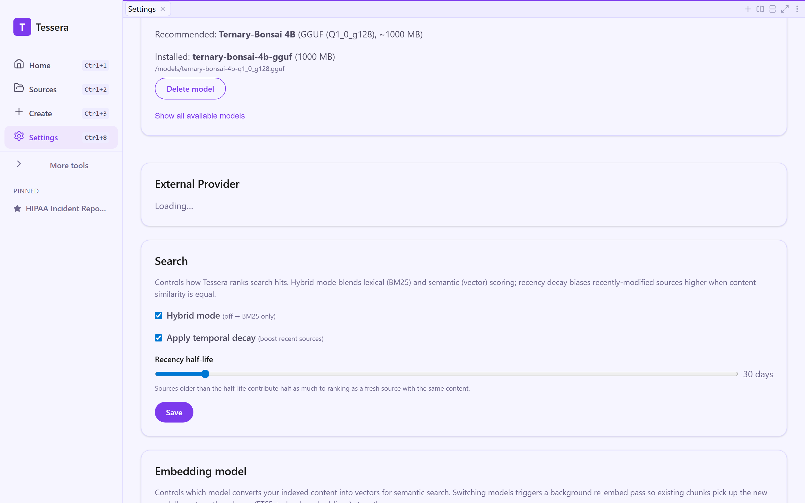
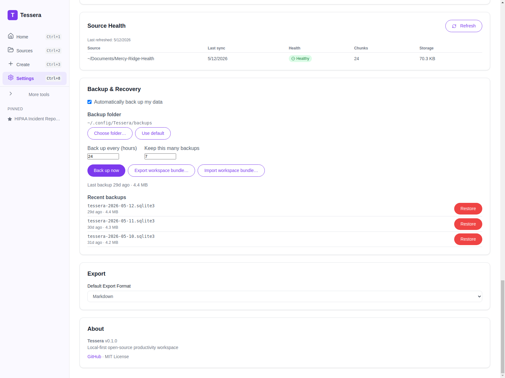
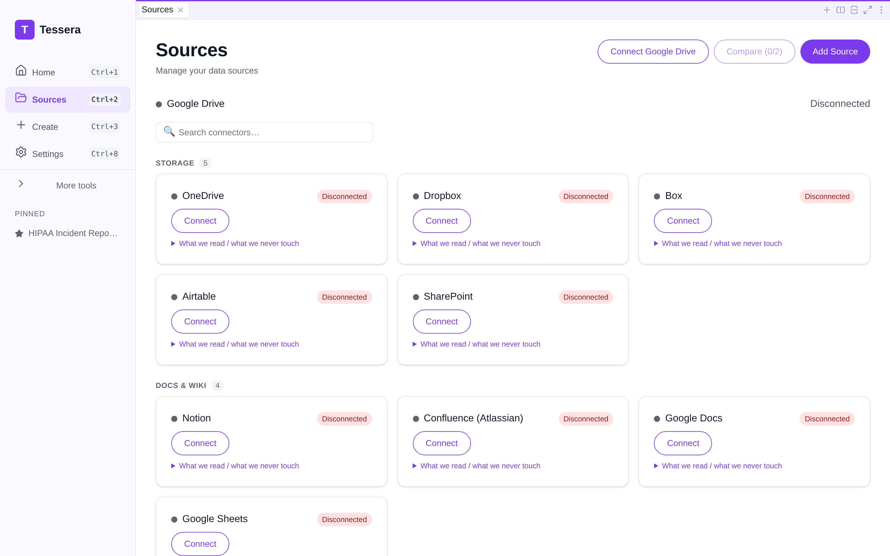

# The knowledge plane: what Tessera extracts, links, and remembers

_Part 7 of the Tessera showcase series — the substrate underneath._

The first six posts followed people from messy sources to a finished, source-cited artifact.
This one goes one layer down, to the **knowledge substrate** that makes that retrieval sharp:
the engines that, on ingest, turn raw indexed text into structured _observations_, score them
with a decay-based _memory_ model, and link recurring entities into a _concept graph_.

Two ground rules for this post, in keeping with the rest of the showcase:

1. **The data is genuine.** Every entity, fact, and concept below was produced by running the
   substrate's exact classification rules over the persona's real indexed content. The derivation
   script ([`scripts/showcase/derive_knowledge.py`](../../scripts/showcase/derive_knowledge.py))
   mirrors the `knowledge` crate's `observation_engine` and writes deterministic output to
   [`apps/desktop/renderer/src/showcase/generated/*.knowledge.ts`](../../apps/desktop/renderer/src/showcase/generated).
   Nothing here is hand-authored — including the occasional rough sentence fragment, which is
   what real extraction over real prose actually looks like.
2. **Every surface here is in the product.** The extraction engines, their data plane, and the
   browsing UI on top of them are all part of the app you install — the dedicated Memory page,
   the concept-graph panel, and the enriched "Knowledge" citation tab included. The "Where to
   find it" section at the end lists every surface and how to reach it.

---

## Step 1 — observations: structure from prose

When a source is indexed, the observation engine classifies each sentence into one of a small
set of types, using the same keyword and pattern rules the `knowledge` crate uses:

- **Entities** — proper nouns, identifier codes (`INC-4471`, `LT-2291`), and regulatory refs
  (`45 CFR §164.402`).
- **Decisions** — sentences carrying decision verbs (decided / approved / recommend / must /
  classify / escalate).
- **Tasks** — TODO / action / "need to" / imperative leads.
- **Questions** — interrogatives.
- **Facts** — declarative sentences that are none of the above (often carrying a quantity or
  an obligation).

Run over Maya's four HIPAA-incident sources, the engine surfaces these entities — each one
traceable to the exact source file it came from:

| Entity                               | Memory state | Retention | Corroboration | First seen in                    |
| ------------------------------------ | ------------ | :-------: | :-----------: | -------------------------------- |
| `LT-2291` (the stolen laptop)        | reinforced   |   0.94    |   2 sources   | `01-helpdesk-ticket-INC-4471.md` |
| `Privacy Office`                     | consolidated |   0.78    |   2 sources   | `01-helpdesk-ticket-INC-4471.md` |
| `45 CFR §164.402` (breach rule)      | candidate    |   0.62    |   1 source    | `04-policy-and-context.md`       |
| `CHG-2208` (the unremediated change) | candidate    |   0.62    |   1 source    | `02-endpoint-mdm-report.md`      |
| `ICD-10` (diagnosis coding)          | candidate    |   0.62    |   1 source    | `03-ehr-export-log.md`           |
| `INC-4471` (the incident itself)     | candidate    |   0.62    |   1 source    | `01-helpdesk-ticket-INC-4471.md` |

This is the difference between "the text is searchable" and "the system knows what's in the
text." The stolen-laptop asset tag, the breach-classification regulation, and the change
ticket that _caused_ the exposure are now first-class objects, not just substrings.

## Step 2 — memory: not everything is equally important

Every observation carries a **memory state** and a **retention score**, and the
`memory_manager` ages them over time on a decay curve (active → fading → archived). Three
signals push a memory up instead of letting it fade:

- **Corroboration** — the same entity appearing in more than one source. `LT-2291` shows up
  in both the helpdesk ticket and the endpoint MDM report, so it's corroborated twice.
- **Retrieval** — how often it's actually been pulled into work.
- **Pinning** — an explicit "this matters" signal.

That's why `LT-2291` sits at **reinforced / 0.94** while a once-seen regulatory reference sits
at **candidate / 0.62**: the laptop is the spine of the whole incident and is mentioned
everywhere, so the system weights it accordingly. The retention score is not decoration — it
becomes a **fourth ranking signal** in search (below).

The **Memory page** browses exactly this plane: every observation with its type, memory state,
and retention score, filterable by decay state and searchable. The pin / unpin / forget
controls are the explicit signals from Step 2.

Raw substrate states collapse into three user-facing buckets: **active** (candidate →
reinforced → consolidated → canonical), **fading** (`superseded`), and **archived** (everything
aged out of the working set). Scrolling down the same list walks the full gradient — here the
`RPD-2026-01188` request stays _active_ at 62%, the prematurely-closed change `CHG-2208` is
_fading_ at 34%, and the caller's disproven encryption assumption has _archived_ at 22%:

The whole app ships a **dark theme** as well — the same Memory page, the same retention
badges and decay buckets, rendered in dark mode:

## Step 3 — the concept graph: linking sources through shared entities

Entities that recur across files become **concept nodes**, each linked to every source it
co-occurs in. From Maya's corpus:

- **`LT-2291`** → linked across `01-helpdesk-ticket` **and** `02-endpoint-mdm-report` — the
  ticket says the laptop was stolen; the MDM report says that same asset was unencrypted. The
  graph connects the _event_ to the _control failure_.
- **`Privacy Office`** → linked across `01-helpdesk-ticket` **and** `04-policy-and-context` —
  who got escalated to, tied to the policy that says they must run the four-factor assessment.
- **`45 CFR §164.402`** → the breach-classification rule, anchored in the policy file.

The **concept-graph panel** at the bottom of the Memory page draws this directly: concept nodes
sized by how connected they are, with **typed** edges between them. Around the `INC-4471` hub
the four relation types the substrate models all appear, each grounded in the source semantics:

- **`is_a`** — each identifier is typed by its scheme: `INC-4471` _is a_ Incident, `LT-2291`
  _is an_ Asset, `ICD-10` _is a_ Clinical code.
- **`part_of`** — the asset, the escalation target, and the breach-classification rule are all
  _part of_ the incident: `LT-2291`, `Privacy Office`, and `45 CFR §164.402` → `INC-4471`.
- **`supersedes`** — the MDM finding that the disk was never encrypted _supersedes_ the change
  ticket `CHG-2208` that had been closed without confirming re-encryption.
- **`contradicts`** — that same finding _contradicts_ the caller's assumption that full-disk
  encryption "should be on", which is why the assumption decayed to `contradicted`.

Selecting a node lists its relationships and the source evidence behind each one. Node color
tracks the concept's lifecycle state (canonical, candidate, `superseded`, `contradicted`).

The canvas renderer carries the dark theme through too — the same typed graph around the
`INC-4471` hub in dark mode:

In the Create flow, this graph powers **"related source" suggestions**: as you select sources
for a new artifact, Tessera proposes others that share concepts with your selection
(`substrate:suggestRelatedSources`). In the showcase each persona is a single indexed folder,
so there's nothing cross-source to suggest — but the wiring is the same one a multi-folder
workspace uses.

## Step 4 — hybrid retrieval, tuned

When the model drafts a section, the text it sees comes from hybrid retrieval that the user
can shape in **Settings → Search**:

- **Hybrid mode** blends lexical BM25 with semantic vector similarity (reciprocal-rank fusion),
  so a query hits both exact terms and paraphrases.
- **Temporal decay** adds a recency bias with an adjustable **half-life** — sources older than
  the half-life contribute half as much at equal content relevance.
- **Memory retention** from Step 2 joins as a fourth fusion signal, nudging corroborated,
  frequently-used knowledge up the ranking.

The embedding model is chosen in the same screen: a zero-download lexical embedder for
strict-offline setups, or a downloadable multilingual model for non-English corpora. Switching
triggers a background re-embed; the schema is unchanged.

## Step 5 — durability: signed export and zero-config backup

A knowledge plane is only trustworthy if the artifacts built on it are verifiable and the store
is recoverable. Two surfaces close that loop:

- **Export Evidence Pack** (document/base editors): a ZIP of the artifact + its cited sources +
  an **ML-DSA-65 (FIPS 204) provenance signature**, so a recipient can confirm the package
  wasn't altered after export — post-quantum-ready, on-device.
- **Backup & Recovery** (Settings): scheduled local hot-copy backups via SQLite's Online Backup
  API, retention pruning, one-click backup/restore, and encrypted workspace-bundle
  export/import — and it covers the substrate's encrypted sibling DBs, not just the main store.

## Where to find it

Here's the map of where every part of the knowledge plane lives in the app — the substrate
engines, their data plane, and the browsing UI on top of them.

**The substrate and its data plane:**

- Observation extraction, decay-based memory, and the concept graph as the on-device knowledge
  substrate (the `knowledge` crate behind `crates/tessera_substrate`), with encrypted sibling
  DBs.
- The data plane over IPC: `sources:searchEnriched` (enriched hybrid results) and
  `substrate:suggestRelatedSources` (concept-graph suggestions in Create).

**The browsing UI, wired into the renderer:**

- A dedicated **Memory page** for browsing the substrate directly — memories with their state
  and retention, plus the concept graph. Reach it from the **Memory** item in the sidebar
  ("More tools" tier, `Ctrl/Cmd+9`) or the `/memory` route.
- The **concept-graph panel** on that page, rendering concept nodes and their typed links over
  your own sources.
- The enriched **"Knowledge" tab** in the citation panel (entities/facts/concepts alongside
  source chunks). It's mounted in the artifact editor: open any artifact and click
  **Citations** to see the Sources/Knowledge tabbed view.
- **HomePage knowledge insights** — a "Knowledge insights" card on the home screen
  summarizing the memory plane and concept graph — and a substrate section on each source's
  detail page.

Sources feeding the plane come from local files or a **searchable, categorized connector
gallery** (Sources page) — OneDrive, Dropbox, Box, Notion, Confluence, Slack, Jira, Linear,
Figma, GitHub, and more — each card stating up front what Tessera reads and what it never
touches.

**The durability and search controls shown above:**

- **Settings → Search** (hybrid + recency half-life), embedding-model selection, **Source
  Health**, **Backup & Recovery**, the home-screen backup indicator, and **Export Evidence
  Pack** with PQC signatures.

The tables earlier in this post are generated straight from the substrate — the data is
genuine — and you can open the Memory page and the Knowledge tab in the app to see the same
engine's output over your own sources.

---

Next: [How Tessera's approach compares to its competitors — honestly →](08-competitive-assessment.md) ·
or back to the [showcase index](../README.md)
